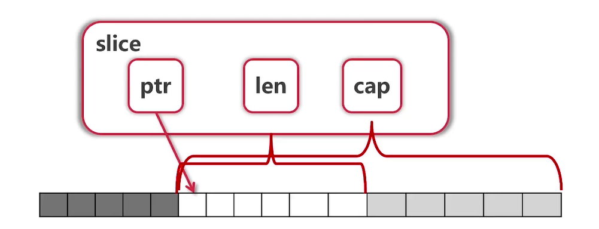
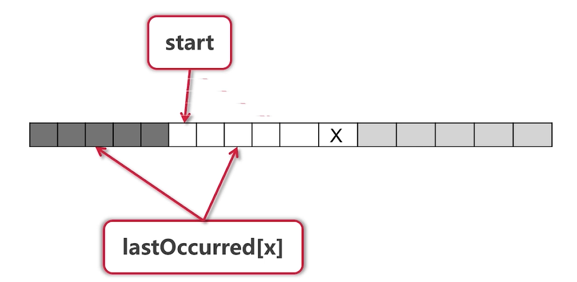
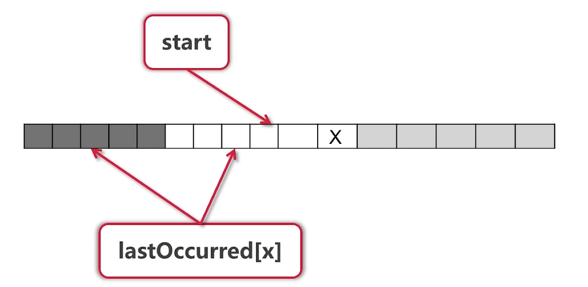
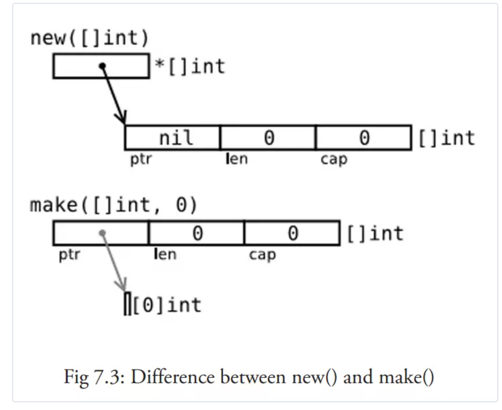

## 1.数组

### 定义数组的几种方法

```go
var arr1 [5]int
arr2 := [3]int{3, 4, 5}   //自动推算类型
arr3 := [...]int{3, 4, 5} //让编译器计算数组长度

var grid [4][5]int
fmt.Println(arr1, arr2, arr3)
fmt.Println(grid)

输出：
[0 0 0 0 0] [3 4 5] [3 4 5]
[[0 0 0 0 0] [0 0 0 0 0] [0 0 0 0 0] [0 0 0 0 0]]
```

### range关键字 进行数组遍历

```go
for i, v := range arr3 {
    fmt.Println(i, v)   //i:数组下标，  v:数组元素
}

//如果只要i,就写成
for i= range arr3 {
    fmt.Println(arr3[i])  
}
```

### 为什么要用range?

1.意义明确，美观

2.C++ 没有类似的能力

3.Java/Python 只能foreach value,不能同时获取 i,v


### 数组是值类型

```go
// []int 代表切片，[5]int 才是数组
func printArray(arr [5]int) {
	for i, v := range arr {
		fmt.Println(i, v)
	}
	arr[0] = 100  //数组是值类型，函数内部改变数组的值，不会影响外部的数组
}
两次执行 printArray(arr3)，输出结果不变
```

- [10]int 和 [20]int 是不同的类型
- 调用func f ( arr [10]int ) 会**拷贝数组**

### 改用指针简化操作

```go
//改用指针，简化操作
func printArray2(arr *[5]int) {
	for i, v := range arr {
		fmt.Println(i, v)
	}
	arr[0] = 100
}

printArray2(&arr3)		//使用指针改变外部数组的值
fmt.Println("指针赋值后")
fmt.Println(arr3)

输出：
指针赋值后
[100 4 5 7 8]
```

由于传参数需要指定数组的长度，特别不方便，Go语言一般不使用数组传参，而是使用 **切片** 代替。

## 2.切片 Slice

### 切片定义

```go
arr := [...]int{0, 1, 2, 3, 4, 5, 6, 7}
s := arr[2:6]  //s就是一个切片 s的值是 [2,3,4,5]  半开半闭区间，不包含6

fmt.Println("arr[2:6] =", arr[2:6])
fmt.Println("arr[:6] =", arr[:6])
fmt.Println("arr[2:] =", arr[2:])
fmt.Println("arr[:] =", arr[:])

输出：
arr[2:6] = [2 3 4 5]
arr[:6] = [0 1 2 3 4 5]
arr[2:] = [2 3 4 5 6 7]
arr[:] = [0 1 2 3 4 5 6 7]
```

### 切片更新

slice是数组的视图，slice内部有一个数据结构

```go
func updateSlice(s []int) {
	s[0] = 100
}


func main() {
	arr := [...]int{0, 1, 2, 3, 4, 5, 6, 7}
	
	s1 := arr[2:]
	fmt.Println("arr[2:] =", s1)
	s2 := arr[:]
	fmt.Println("arr[:] =", s2)

	fmt.Println("after updateSlice s1")
	updateSlice(s1)
	fmt.Println(s1)
	fmt.Println(arr)
}
输出：
after updateSlice s1
[100 3 4 5 6 7]
[0 1 100 3 4 5 6 7]
```

Slice本身没有数据，是对底层array的一个view。

### Reslice

所有的切片都是对应的同一个数组。

```go
fmt.Println(arr)
fmt.Println("Reslice s2")
s2 = s2[:5]
fmt.Println(s2)
s2 = s2[2:]
fmt.Println(s2)
输出：
[0 1 100 3 4 5 6 7]
Reslice s2
[0 1 100 3 4]
[100 3 4]		
```

### Slice扩展

```go
arr := [...]int{0, 1, 2, 3, 4, 5, 6, 7}
s1:= arr[2:6]
s2:= s1[3:5]
```

- S1的值为？
- S2的值为？

```go
fmt.Println("Extending slice ")
arr[0], arr[2] = 0, 2
s1 = arr[2:6]
s2 = s1[3:5]
fmt.Println("s1 =", s1)
fmt.Println("s2 =", s2)
输出：
Extending slice 
s1 = [2 3 4 5]
s2 = [5 6]  //6不属于s1也能够被输出。
```

### Slice的实现



- 使用索引取值的时候，索引不能超过len区域。cap里的值都是可以扩展的值。
- slice可以向后扩展，不可以向前扩展
- s[i] 不可用超越len(s), 向后扩展不可以超越底层数组 cap(s) 。 cap: capacity   [kəˈpæsəti]，容量，容积，名词
- s[i:j]  j的值取决于cap  j<cap    j最大值为 cap-1

```go
s1 = arr[2:6]
s2 = s1[3:5]
fmt.Printf("s1=%v, len(s1)=%d,cap(s1)=%d\n", s1, len(s1), cap(s1))
fmt.Printf("s2=%v, len(s2)=%d,cap(s1)=%d\n", s2, len(s2), cap(s2))
输出：
s1=[2 3 4 5], len(s1)=4,cap(s1)=6
s2=[5 6], len(s2)=2,cap(s1)=3
```

### 向切片添加元素

```go
arr := [...]int{0, 1, 2, 3, 4, 5, 6, 7}
s1:= arr[2:6]
s2:= s1[3:5]
s3:= s1.append(s2,10)
s4:= s1.append(s3,11)
s5:= s1.append(s4,12)
```

**s3,s4,s5的值为？？	arr的值为？**

```go
s3,s4,s5 = [5 6 10] [5 6 10 11] [5 6 10 11 12]   //s4,s5已经不再是 arr的view
arr = [0 1 2 3 4 5 6 10]
```

- 添加元素时，如果超越cap，系统会重新分配更大的底层数组
- 由于值传递的关系，必须接收append的返回值
- s = append(s,val)

### 切片的操作

切片的创建

```go
func printSlice(s []int) {
	fmt.Printf("%v len=%d,cap=%d\n", s, len(s), cap(s))
}

func main() {
	var s []int // Zero value for slice is nil   创建方式一
	for i := 0; i < 100; i++ {
		printSlice(s)
		s = append(s, 2*i+1)
	}
	fmt.Println(s)

	s1 := []int{2, 4, 6, 8} //创建方式二
	printSlice(s1)

	s2 := make([]int, 16)
	s3 := make([]int, 10, 32) // len 10 ,cap 32

	printSlice(s2)
	printSlice(s3)
}
```

切片的复制

```go
fmt.Println("Copying slice")
copy(s2, s1)
printSlice(s2)
输出：
Copy slice
[2 4 6 8 0 0 0 0 0 0 0 0 0 0 0 0] len=16,cap=16
```

切片的删除

```go
fmt.Println("Deleting  elements from slice")
s2 = append(s2[:3], s2[4:]...)
printSlice(s2)
输出：
Deleting  elements from slice
[2 4 6 0 0 0 0 0 0 0 0 0 0 0 0] len=15,cap=16
```

切片的首尾弹出

```go
fmt.Println("Popping from front")
front := s2[0]
s2 = s2[1:]
printSlice(s2)

fmt.Println("Popping from tail")
tail := s2[len(s2)-1]
s2 = s2[:len(s2)-1]
printSlice(s2)
fmt.Println(front, tail)

输出：
Popping from front
[4 6 0 0 0 0 0 0 0 0 0 0 0 0] len=14,cap=15
Popping from tail
[4 6 0 0 0 0 0 0 0 0 0 0 0] len=13,cap=15
2 0
```

## 3.Map

### map定义

```go
//第一种定义
m := map[string]string{
		"name":    "ccmouse",
		"course":  "golong",
		"site":    "imooc",
		"quality": "notbad",
	}
//第二种
m2 := make(map[string]int)  //m2 == empty map
//第三种
var m3 map[string]int		//m3 == nill

fmt.Println(m, m2,m3)

输出：
map[course:golong name:ccmouse quality:notbad site:imooc]  map[]  map[]
```

简单map:	map[K]V,   		复合map:	map[K1] map[k2]V

### 遍历

```go
fmt.Println("Traversing map")
for k, v := range m {
    fmt.Println(k, v)
}
map 的key 是无序的，每次输出顺序都不一样。
```

- 不保证遍历顺序，如需顺序，需要手动对key排序。例如把key存放到slice中，slice是有序的,然后遍历key.
- 使用len 获取元素个数

### 取值

```go
fmt.Println("Getting values")
courseName := m["course"]
fmt.Println(courseName)

courseName, ok := m["course"] //key不存在，返回空串,ok==false
fmt.Println(courseName, ok)
if cname, ok := m["cname"]; ok {
    fmt.Println(cname)
} else {
    fmt.Println("key does not exist")
}
```

- key不存在时，获取Vlue类型的初始值
- 用 value,ok := m[key] 来判断是否存在key

### 删除

```go
fmt.Println("Deleting values")
delete(m, "name")
name, ok := m["name"]
fmt.Println(name, ok)
输出：
Deleting values
 false
```

- map使用哈希表，必须可以比较相等。（java中类型需要实现hashcode,equal函数，类型的对象才能用作map的key）
- 处理slice,map,function 的内建类型都可以用作key
- Struct类型，不包含上述类型的字段，也可以用作key。在编译的时候会自动检查。（不需要定义hashcode等方法）

### 例题：寻找最长不含重复字符的字串

- abcabcbb -->	abc
- bbbbb -->   b
- pwwkew  -->   wke





实现：对于每一个字母X

- lastOccurred[x]不存在，或者 <start    ==>  无需操作

- lastOccurred[x] >= start    ==>  更新 start

- 更新 lastOccurred[x]，更新maxLength


## 4、make 和 new 区别




## 5、字符串国际化

```go
s := "Yes我爱小米!"
fmt.Println(len(s))

for _, b := range []byte(s) {
    fmt.Printf("%X ", b)
}

输出：
16
59 65 73 E6 88 91 E7 88 B1 E5 B0 8F E7 B1 B3 21   //utf-8是可变长的，英文一个字节，汉字3个字节

for i, ch := range s {  				// ch is  a rune
    fmt.Printf("(%d %X)", i, ch)    	// i 的值就是每个字符的索引
}
输出：
(0 59)(1 65)(2 73)(3 6211)(6 7231)(9 5C0F)(12 7C73)(15 21)  // ch is  a rune(4个字节)
```

rune相当于go的char

- 使用range遍历pos,rune对
- 使用 utf8.RuneCountInString 获得字符数量
- 使用 len 获得字节的长度
- 使用 []byte 获得字节

### 其他字符串操作

- Fields,Split,Join  			(Fields 能识别空格)
- Contains,Index
- ToLower,ToUpper
- Trim,TrimRight,TrimLeft