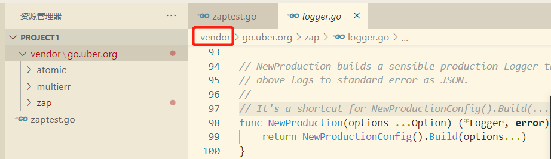

## 1、依赖管理介绍

依赖管理的三个阶段：GOPATH,GOVENDOR,go mod


## 2、GOPATH 和 GOVENDOR

### GOPATH

默认在用户目录下 go :	~ /go (unix,linux)，	%USERPROFILE% \ go (windows)  

本机:  GOPATH=C:\Users\Francisco\go     

一般系统常用配置：	%USERPROFILE% =C:\Users\用户名

gopath管理方式造成所有项目都在gopath下，所有依赖也都在gopath下面，gopath就会越来越大。

**GOPATH**即存放第三方库的位置。通常开发时，会把GOPATH重新设置。

###  GOPATH目录

1. bin：放置编译后生成的可执行文件。
2. pkg：放置编译后生成的包/库的归档文件；
3. src：放置项目和库的源文件；1

####  src

用于以包（package）的形式组织并存放 Go 源文件，这里的包与 src 下的每个子目录是一一对应。例如，若一个源文件被声明属于 log 包，那么它就应当保存在 src/log 目录中。

并不是说 src 目录下不能存放 Go 源文件，一般在测试或演示的时候也可以把 Go 源文件直接放在 src 目录下，但是这么做的话就只能声明该源文件属于 main 包了。正常开发中还是建议大家把 Go 源文件放入特定的目录中。

另外需要注意的是，Go语言会把通过`go get`命令获取到的库源文件下载到 src 目录下对应的文件夹当中。

####  pkg

用于存放通过`go install`命令安装某个包后的归档文件。归档文件是指那些名称以“.a”结尾的文件。

该目录与 GOROOT 目录（也就是Go语言的安装目录）下的 pkg 目录功能类似，区别在于这里的 pkg 目录专门用来存放项目代码的归档文件。

编译和安装项目代码的过程一般会以代码包为单位进行，比如 log 包被编译安装后，将生成一个名为 log.a 的归档文件，并存放在当前项目的 pkg 目录下。

####  bin

与 pkg 目录类似，在通过`go install`命令完成安装后，保存由 Go 命令源文件生成的可执行文件。在类 Unix 操作系统下，这个可执行文件的名称与命令源文件的文件名相同。而在 Windows 操作系统下，这个可执行文件的名称则是命令源文件的文件名加 .exe 后缀。


## 3、GOPATH试验

```shell
mkdir /tmp/gopathtest
cd /tmp/gopathtest

# 接下来修改 gopath  go env -w 命令可以直接修改gopath 
# 使用export 可以临时修改
export gopath=/tmp/gopathtest
mkdir src   # src下可以放各种代码
src 下面新建项目 project1

#github地址：https://github.com/uber-go/zap
go get -u go.uber.org/zap

# 关闭go mod 命令： go env -w GO111MODULE=on, GO111MODULE的值是算出来的，在linux系统中可以通过export临时修改
# 临时关闭go mod
export GO111MODULE=off
```

```go
package main

import "go.uber.org/zap"

func main() {
	log, _ := zap.NewProduction()
	log.Warn("warn test")
}
```

当 import导入不存在的包时，运行会报编译错误	（go run zaptest.go）

zaptest.go:4:2: cannot find package "github/aaa/bb" in any of:
        D:\Program Files\Go\src\github\aaa\bb (from $GOROOT)
        C:\Users\Francisco\go\src\github\aaa\bb (from $GOPATH)

```go
package main

import (
	"github/aaa/bb"
	"go.uber.org/zap"
)

func main() {
	bb.Nn()
	log, _ := zap.NewProduction()
	log.Warn("warn test")
}
```


## 4、VENDOR

在gopath目录下依赖包只能有一个版本，为了解决版本冲突，需要使用vendor解决。

```shell
mkdir src/project1/vendor
mkdir src/project2/vendor
```

将第三方包拷贝到 vendor里边，这时候看IDE源码位置，会发现源码为vendor目录下的源码。



当 import导入不存在的包时，先在vendor目录下查找，运行会报编译错误	（go run zaptest.go）

```go
package main
import (
	"github.com/aaa/bb"
	"go.uber.org/zap"
)
func main() {
	bb.Nn()
	log, _ := zap.NewProduction()
	log.Warn("warn test")
}
```

zaptest.go:4:2: cannot find package "github.com/aaa/bb" in any of:
        C:\Users\Francisco\go\src\project1\vendor\github.com\aaa\bb (vendor tree)
        D:\Program Files\Go\src\github.com\aaa\bb (from $GOROOT)
        C:\Users\Francisco\go\src\github.com\aaa\bb (from $GOPATH)


- 每个项目有自己的vendor目录，存放第三方库，一定程度上解决了包冲突问题
- 为了简化手工拷贝第三方库到vendor，出现了大量第三方工具： glide,dep,go dep,......
- 第三方工具 比如glide通过配置文件yml配置依赖，自动拷贝到vendor目录