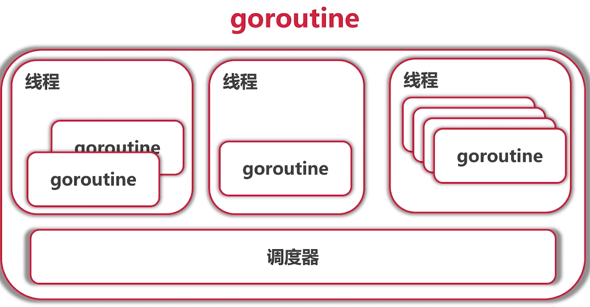
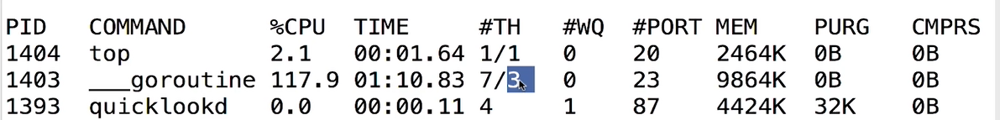

## 1、 goroutine

### 代码示例

go语言对并发编程有原生支持，这在通用语言中很少见，有关键字go。

```go
func main() {
	for i := 0; i < 1000; i++ {
		//一般写成匿名函数会简单写，不需要单独再写一个函数。
		//相当于开了一个线程，实际上是协程。
		go func(i int) {
			for {
				fmt.Printf("Hello from "+
					"goroutine %d\n", i)
			}
		}(i)
	}
	time.Sleep(time.Minute)
}
```

### 协程Coroutine

- 轻量级”线程“
- 非抢占式多任务处理，由协程主动交出控制权
- 编译器/解释器/虚拟机层面的多任务
- 多个协程可能在一个或多个线程上运行。


```go
func main() {
	var a [10]int
	for i := 0; i < 10; i++ {
		go func(i int) {
			for {
				a[i]++
			}
		}(i)
	}
	time.Sleep(time.Minute)
	fmt.Println(a)
}
```

在Go旧版本中由于第一个协程无法退出，又不像第一个案例中有IO阻塞，所以没法交出控制权，导致主协程也没法继续执行，于是陷入了死循环。

[golang v1.14 Runtime](https://link.zhihu.com/?target=https%3A//golang.org/doc/go1.14)引入了goroutine异占抢占，避免了潜在的调度器死锁。


Go 语言基于信号的异步抢占的全过程：

1. M 注册一个 SIGURG 信号的处理函数：sighandler。

2. sysmon 线程检测到执行时间过长的 goroutine、GC stw 时，会向相应的 M（或者说线程，每个线程对应一个 M）发送 SIGURG 信号。

3. 收到信号后，内核执行 sighandler 函数，通过 pushCall 插入 asyncPreempt 函数调用。

4. 回到当前 goroutine 执行 asyncPreempt 函数，通过 mcall 切到 g0 栈执行 gopreempt_m。

5. 将当前 goroutine 插入到全局可运行队列，M 则继续寻找其他 goroutine 来运行。

6. 被抢占的 goroutine 再次调度过来执行时，会继续原来的执行流
   

### 手动交出控制权

```go
func main() {
	var a [10]int
	for i := 0; i < 10; i++ {
		go func(i int) {
			for {
				a[i]++
				runtime.Gosched()  //手动交出控制权,一般情况下即使不写这句，也会有机会交出控制权
			}
		}(i)
	}
	time.Sleep(time.Millisecond)
	fmt.Println(a)
}
```

### 数组越界

```go
func main() {
	var a [10]int
	for i := 0; i < 10; i++ {
		go func() {
			for {
				a[i]++
				runtime.Gosched()
			}
		}()
	}
	time.Sleep(time.Millisecond)
	fmt.Println(a)
}
//会产生 runtime error: index out of range [10] with length 10
//使用 go run -race goroutine.go	检测数据冲突，当main跳出循环后，i的值最终为10，产生越界。
```

## 2 、go语言的调度器

### 协程和普通函数区别

协程控制权可以双向交换，这样才能很多个协程一起运行。


### 其他语言中的协程

- C++: Boost.Coroutine
- Java:不支持
- pathon: 3.5之前使用yield 关键字实现协程，Python3.5 加入了 async def 对协程原生支持





### gorutine的定义

- 任何函数只要加上关键字go就能发送给调度器运行
- 不需要在定义时区分是否是异步函数，任何普通函数只要加了go，都可以异步执行。
- 调度器会在合适的点进行切换。
- 使用 -race 来检测数据访问的冲突


### gorutine可能的切换点

- I/O，select
- channel
- 等待锁
- 函数调用（有时）
- runtime.Gosched()
- 只是参考，不能保证切换，不能保证其他地方不切换


运行创建1000个协程的代码，然后使用**top**命令查看，可以发现总线程数7，活动线程数3、4个，因为cpu核数4。

虽然最终1000个线程，但是会映射到4个线程里。

