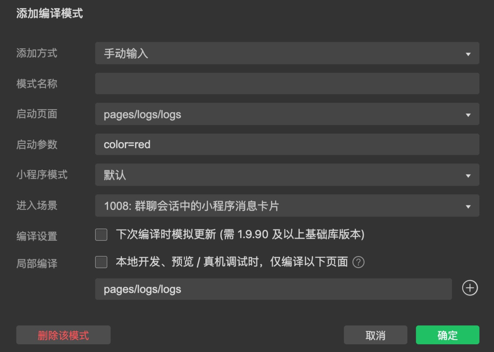

## 1、小程序的运行机制与setdata渲染

### 调试方法

点击调试器小箭头——选中模拟器中的页面元素——调试器wxml显示对应的元素标签——style显示样式

鼠标移动到调试器中的wxml标签——模拟器中对应的页面元素高亮

修改 element.style 来对元素样式进行修改

```css
element.style {
    font-size: 28px;
}
```

### 动态修改data

```xml
<button type="primary" bindtap="onBtnTap">修改motto</button>
```

```js
onBtnTap: function() {
  //需要使用内置的方法，而不能直接修改data，否则页面不会重新渲染。
  this.setData({
    motto: "button clicked"
  })
}
```

### 调试器修改data

选中AppData——直接修改属性值


### 添加编译模式

启动页面、启动参数、场景 三个属性可以打包进二维码，然后添加方式通过解析二维码进行添加

启动页面的值可以修改，从而改变启动页面


