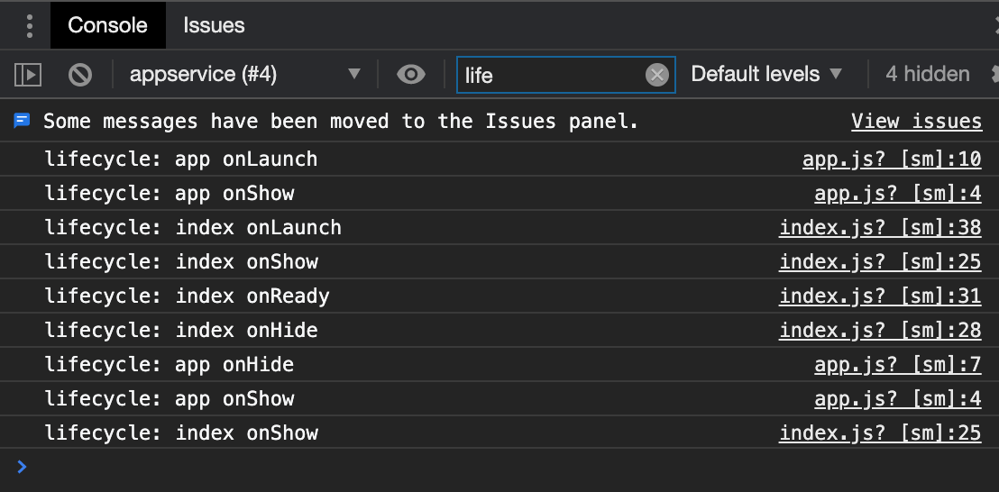

## 1、小程序的生命周期

### 整个小程序生命周期-app.js

onLaunch -> onShow -> onHide

### 页面生命周期-index.js

onLoad -> onShow -> onReady (渲染完成)

### 启动小程序-小圆圈-重新进入的执行顺序

点击右上角 小圆圈 和 微信工具上的 切后台 按钮功能上一样的。

切前台，就是重新进入小程序

3-5分钟，小程序才会被销毁。（右上角...-进入页面-打开真机调试）

切后台等几分钟，再打开小程序，会看到 日志输出 app onLaunch，而不是 onShow,说明小程序被销毁了。

