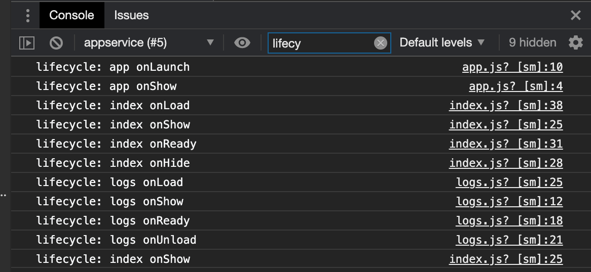

## 1、小程序的生命周期

### 整个小程序生命周期-app.js

onLaunch -> onShow -> onHide

### 页面生命周期-index.js

onLoad -> onShow -> onReady (渲染完成)

### 启动小程序-小圆圈-重新进入的执行顺序

点击右上角 小圆圈 和 微信工具上的 切后台 按钮功能上一样的。

切前台，就是重新进入小程序

3-5分钟，小程序才会被销毁。（右上角...-进入页面-打开真机调试）

切后台等几分钟，再打开小程序，会看到 日志输出 app onLaunch，而不是 onShow,说明小程序被销毁了。


## 2、小程序页面栈

### 页面栈

先打开index页面 --> 再跳转到logs页面  --> 再返回到index页面

在AppData的pages栏里可以看到页面栈

 


### 三个页面之间跳转

index->logs->test2


### 使用redirectTo

*销毁当前页面(unLoad)，然后重新打开url页面。*如果当前页面位于栈的开始位置，则页面不会显示回退按钮，而是显示home按钮。

```javascript
onLogTap() {
  // wx.navigateTo({
  //     // url: '../test2/test2'
  //     url: '/pages/test2/test2' //这里改为绝对路径比较好
  // })

  wx.redirectTo({
    url: '/pages/test2/test2' 
  })
}
```

## 3、调试工具的使用

source窗口可以看源码，其中 .js[sm] 文件是未被处理过的源码文件，可以在其中加入断点。

Sensor可以模拟地理位置经纬度的值。

Storage是一个本地的存储，小程序允许在本地存储少量的数据，在小程序杀掉之后，数据还是会被存放在本地。以key-value形式存在。

清除缓存可以模拟用户第一次使用小程序的场景。
