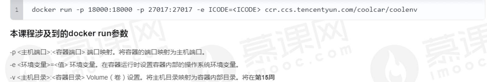
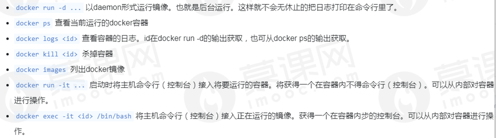
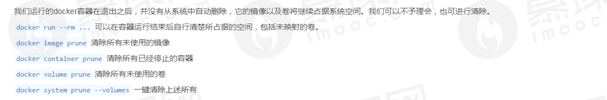

## 1-2、给小程序添加地图组件

wxml加入地图组件

```html
<map
class="map"
  id="map"
  latitude="{{location.latitude}}"
  longitude="{{location.longitude}}"
  scale="{{scale}}"
  setting="{{setting}}"
  enable-overlooking="{{isOverLooking}}"
  enable-3D="{{is3D}}"
  markers="{{markers}}" 
/>
```

js文件中配置数据

```js
Page({
    data: {
        avatarURL: '',
        setting: {
            skew: 0,
            rotate: 0,
            showLocation: true,
            showScale: true,
            subKey: '',
            layerStyle: 1,
            enableZoom: true,
            enableScroll: true,
            enableRotate: false,
            showCompass: false,
            enable3D: false,
            enableOverlooking: false,
            enableSatellite: false,
            enableTraffic: false,
        },
        location: {
            latitude: initialLat,
            longitude: initialLng,
        },
        scale: 6,
        markers: [{
            iconPath: "/resources/car.png",
            id: 0,
            latitude: 23.099994,
            longitude: 113.324520,
            width: 50,
            height: 50
        }, {
            iconPath: "/resources/car.png",
            id: 1,
            latitude: 23.099994,
            longitude: 113.324520,
            width: 50,
            height: 50
        }]
    },
})
```

编写 map、page  样式，使地图充满整个屏幕

```css
/**index.wxss**/

.userinfo {
    display: flex;
    flex-direction: column;
    align-items: center;
    color: #aaa;
}

.userinfo-avatar {
    overflow: hidden;
    width: 128rpx;
    height: 128rpx;
    margin: 20rpx;
    border-radius: 50%;
}

.usermotto {
    margin-top: 200px;
}

.map {
    width: 100%;
    height: 100%;
}

page {
    width: 100%;
    height: 100%;
}
```

## 4、docker简介

在个人PC上安装docker现在一般都推荐使用 docker desktop安装，mac，windows都有相应的版本，可以一键安装。

### 常用docker命令




### 其他有用的docker命令及参数



### 强迫症的福音，有关docker占据空间的清理



### VSCode Docker 插件

Docker  Makes it easy to create, manage, and debug containerized applications.

安装该插件，可以更好的与docker交互。


## 5、 汽车位置实时更新展示

详细见code,地图数据只有一部分。

核心代码：

```js
pathIndex: 0,
  translateMarker(ctx) {
  console.log("pathIndex: " + this.pathIndex)
  this.pathIndex++
  if (this.pathIndex >= raceData.path.length) {
    return
  }
  ctx.translateMarker({
    markerId: 2,
    destination: {
      latitude: raceData.path[this.pathIndex].lat,
      longitude: raceData.path[this.pathIndex].lng,
    },
    duration: 200,
    success: () => this.translateMarker(ctx)
  })
},
  onReady() {
    //第一个参数上map的id,使用wx的方法，不必渲染整个map
    const ctx = wx.createMapContext('map', this)
    this.translateMarker(ctx)
  },
```

