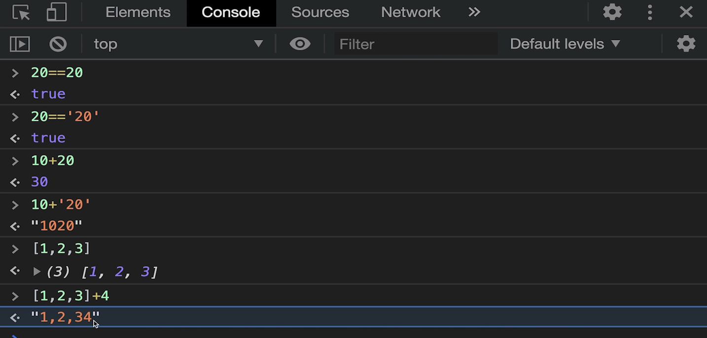

## 1、javascript回顾

javascript是一门糟糕的语言，有很多版本，比如 es5,es6。各个浏览器兼容情况不一样。

Babel可以使人在编写的时候使用最新版本的语法，然后由babel负责编译翻译成旧的语法。

随便在一个浏览器 console 窗口，就可以编写 js 代码。

弱类型语言缺点引发的各种问题：

后台返回的错误码200、404 ，在不同的操作系统比如 ios里解析为数字，安卓里是字符串。

## 2、typescript简介

为了不使用javascript做了哪些努力？

微软

- ActiveX 控件 （c++开发）,打开网页突然就中毒了。
- SilverLight  （c#）,必须装插件，很不友好

Adobe

- Flex （ActionScript），基于flash,虽然也装插件，但是flash插件安装的比较多。但是Adobe重心不在前端页面。

Google

- GWT, Googel Web Toolkit,使用java编写前端页面，能把java编译成javascript,但是根本就没法调试，出问题了不知道对应的是哪行java代码，所以也失败了。
- dart，上面想法失败之后，想出一门新语言，但是其他浏览器不支持，所以也失败了。现在在其他领域取得了成功，变成了一个flutter的语言。

上面这些方法都失败之后，考虑推出一个javascript的超集，衔接javascript生态，最终取得了成功。

**typescript = javascript + 类型定义**，各种框架更新的非常快，包含 vue,react,微信小程序等都支持了typescript。

