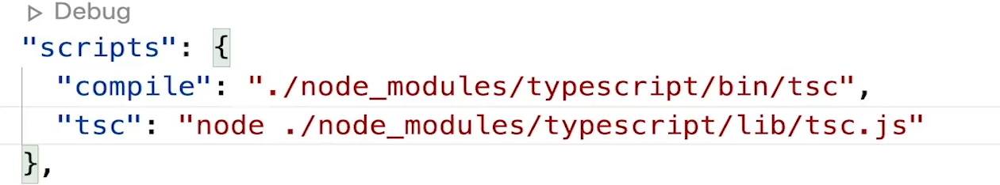

## 1、 node和typescript的安装

### node、npm安装

官网下载安装包安装，会自动添加环境变量


### typescript安装

一般不需要安装，可以使用使用 npx tsc 命令允许 ts

npx tsc: 如果本地有 tsc 包就运行，没有就下载，然后临时安装运行 tsc,运行结束后删除临时安装的tsc。

```sh
#查看仓库地址
npm get registry
#设置成国内地址
npm set registry  https://registry.npm.taobao.org
```


我自己尝试的时候，发现需要先安装 typescript

安装 typescript：

```shell
npm install -g typescript  #如果提示权限不足，加sudo
```

安装完成后我们可以使用 **tsc** 命令来执行 TypeScript 的相关代码，以下是查看版本号：

```sh
$ tsc -v
Version 4.6.3
```

之后可以正常使用 npx tsc 命令。


## 2、 typescript小程序代码的生成

新建小程序项目，语言选择 typescript


新版本开发者工具针对ts编译进行了优化：

工具通过对内置的编译流程进行优化，以编译插件的方式，改进了对 typescript 项目支持。

1. 相比起之前 Typescript 项目中会同时存在 ts 文件和 js 文件，新的模板只需要创建 ts 文件即可，无需再生成同名的 js 文件。
2. 新的模板无需在每次编译前执行 npm run tsc 命令。


## 3、 typescript小程序代码的生成

有时候错误信息一闪而过，需要我们**勾选 console 设置里的 Preserve log** 选项。但是这种方式不会每次编译自动清除log,所以一般情况下不勾选。

在老版本的微信开发者工具，运行自定义命令 npm run tsc,实际上是运行的配置文件里的tsc所配置的命令




tsc.js 会根据tsconfig.json配置文件的选项进行编译。在配置文件中，exclude 选项排除了对第三方依赖进行编译。

在老版本的开发者工具中，会将 tsc.js包下载到 node_modules 目录下，新版本的开发者工具中因为内置了tsc，所以不会在将typescript库下载到node_modules目录里了。


## 4、gitignore的配置

在 .ignore 中添加配置  

```properties
wx/miniprogram/**/*.js
node_modules
```

这样在第一次下载项目代码后，需要 npm install 安装依赖包。
