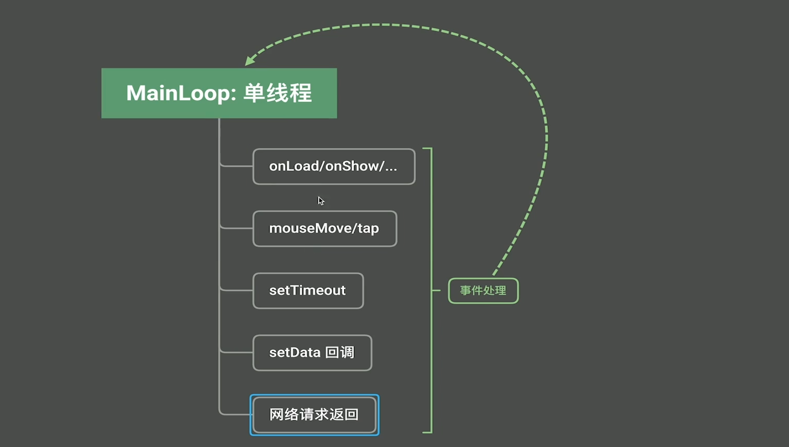

## 1、函数式编程总结

### 纯粹的函数式编程

纯粹的函数式编程由下面几部分组成，只要符合函数式编程风格，我们就说这种编程语言支持函数式编程。

纯粹的函数式编程语言不多。

1. 函数式编程风格

   - 函数是一等公民
   - 高级函数
   - 闭包
   - 部分应用函数

2. 惰性计算

   lazy evaluation

   ```typescript
   function add(a:number,b:number){
     //2, 3+4
     return a+b
     // return 2+(3+4)
   }
   //js 会先把3+4算出来 然后add(2,7),而不是直接把 3+4 原样传给函数，在函数内部再计算。所以 js 不具备惰性计算。
   console.log(add(2,3+4))
   ```

   

3. 引用透明性

   ```typescript
   function add(a:number,b:number){
     console.log(a,b)
     return a+b
   }
   
   //虽然打印结果一样，但是add()会打印日志，所以 add 函数不具备引用透明性。如果等价，就是具有引用透明性。
   console.log(add(2,3)) 
   console.log(5)
   ```

   

4. 无副作用


## 2、函数式编程在小程序中的应用

### UI无法响应




onLoad被阻塞，导致UI无法及时响应新的用户事件的写法:

```typescript
 onLoad() {
    // @ts-ignore
    if (wx.getUserProfile) {
      this.setData({
        canIUseGetUserProfile: true
      })
    }
    this.updateMota()
  },
    
  updateMota(){
    for(let i=0;i<3000;i++){
      this.setData({
        motto:`update count ${i}`,
      }
      )
    }
  }
```

### 改进

上述方法，由于onLoad没法立即结束，js 又是单线程，导致界面无法响应新的事件，此时用户点击按钮无反应。

下面为改进的写法，为setData设置回调函数。这样onLoad方法能马上结束，同时响应新的用户点击事件

```typescript
Page({
  cnt:0,
  data: {
    motto: 'Hello World From Typescript',
    userInfo: {},
  },
  
  onLoad() {
   	//....
    this.updateMota()
  },
 
  updateMota(){
     this.cnt++
     if(this.cnt<50000){
        this.setData({
          motto:`update count ${this.cnt}`,
        },()=>{
          this.updateMota()
        })
     }
  }
  
})
```

### 改定时任务

```typescript
Page({
  cnt:0,
  shouldStop:false,
  data: {
    motto: 'Hello World From Typescript',
  },
  onLoad() {
    setInterval(()=>{
      this.shouldStop=true
    },10000)
    this.updateMota()
  },
 
  updateMota(){
     this.cnt++
     if(!this.shouldStop){
        this.setData({
          motto:`update count ${this.cnt}`,
        },()=>{
          this.updateMota()
        })
     }
  }
  
  
})
```

### 去掉全局变量，增加可维护性

```typescript
onLoad() {
    this.updateMota()
  },

updateMota(){
    let shouldStop=false
    setInterval(()=>{
      shouldStop=true
    },10000)

    let cnt = 0
    const update = ()=>{
      if(!shouldStop){
        cnt++
        this.setData({
          motto:`update count ${cnt}`,
        },()=>{
          update()
        })
     }
    }
		//并不像传统的递归，调用一次，注册了setData回调函数之后，本次update函数就结束了。
    //不会一直积累在栈中，等待下一级递归返回结果，这一点非常好。
    update()  
  }
```

### this指向不明确的坑

```typescript
updateMota(){
    let shouldStop=false
    setInterval(()=>{
      shouldStop=true
    },10000)

    let cnt = 0
    const update = funtion(){
      if(!shouldStop){
        cnt++
        //此次this会报错，不清楚this是指向 update函数所在的 updateMoto 还是外面的 Page 参数对象
        //使用箭头函数可以避免使用this。
        this.setData({
          motto:`update count ${cnt}`,
        },()=>{
          update()
        })
     }
    }
    update()  
}

getUserInfo(e: any) {
   	//此处的this很明确，就是指向的 getUserInfo变量所在的 Page 参数对象。
    this.setData({
      userInfo: e.detail.userInfo,
      hasUserInfo: true
    })
  },
```


### 更保险的this报错解决方法

虽然这种方法更保险，但代码写出来很难看，所以首选还是箭头函数。实在没法解决的时候，采用下面这种方法。

```typescript
updateMota(){
    let shouldStop=false
    setInterval(()=>{
      shouldStop=true
    },10000)

    let cnt = 0
    const that = this  //此处明确 that 就是 Page 参数对象。
    const update = funtion(){
      if(!shouldStop){
        cnt++
        that.setData({
          motto:`update count ${cnt}`,
        },()=>{
          update()
        })
     }
    }
    update()  
}
```


19min
