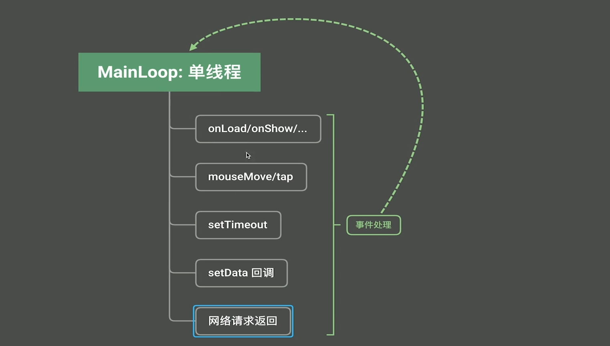

## 1、函数式编程总结

### 纯粹的函数式编程

纯粹的函数式编程由下面几部分组成，只要符合函数式编程风格，我们就说这种编程语言支持函数式编程。

纯粹的函数式编程语言不多。

1. 函数式编程风格

   - 函数是一等公民
   - 高级函数
   - 闭包
   - 部分应用函数

2. 惰性计算

   lazy evaluation

   ```typescript
   function add(a:number,b:number){
     //2, 3+4
     return a+b
     // return 2+(3+4)
   }
   //js 会先把3+4算出来 然后add(2,7),而不是直接把 3+4 原样传给函数，在函数内部再计算。所以 js 不具备惰性计算。
   console.log(add(2,3+4))
   ```

   

3. 引用透明性

   ```typescript
   function add(a:number,b:number){
     console.log(a,b)
     return a+b
   }
   
   //虽然打印结果一样，但是add()会打印日志，所以 add 函数不具备引用透明性。如果等价，就是具有引用透明性。
   console.log(add(2,3)) 
   console.log(5)
   ```

   

4. 无副作用


## 2、函数式编程在小程序中的应用





15min
