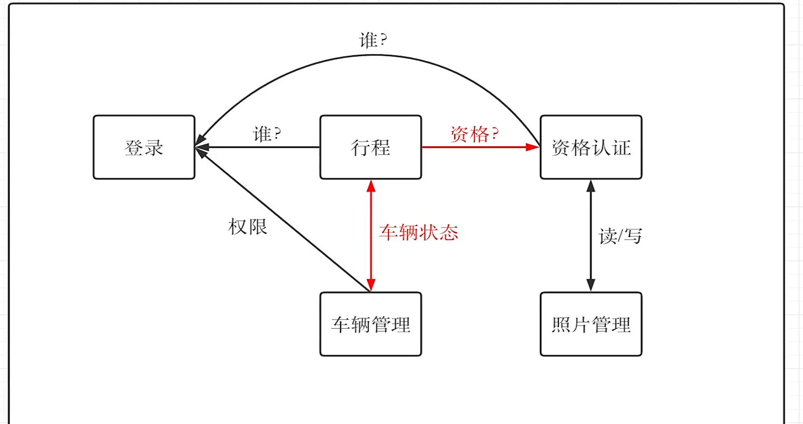
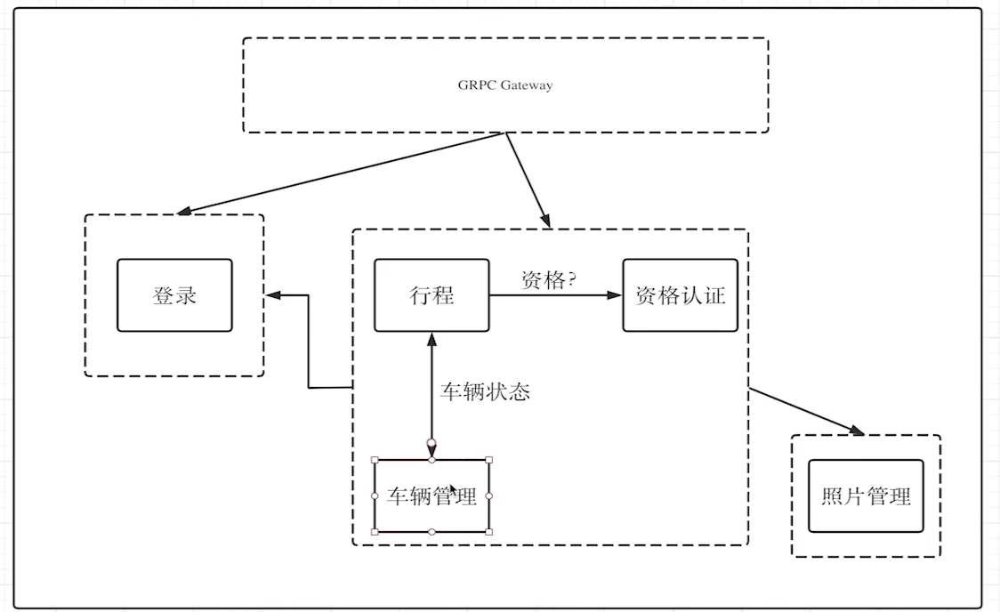
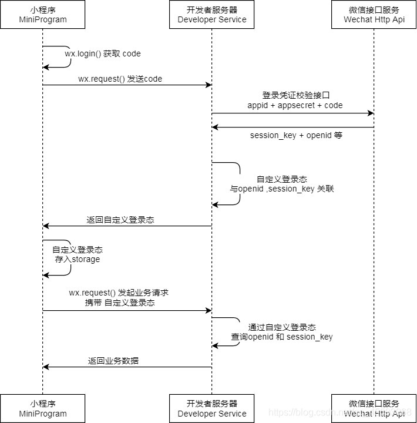

## 1、进一步理解微服务

### 微服务特性

- 快速开发/迭代 （微服务的因）
- 自动化部署（系统复杂性增大引入）
- 独立部署 （微服务的因）
- 错误隔离 （微服务的因）
- 负载均衡 （系统复杂性增大引入）
- 出错处理 （系统复杂性增大引入）
- 链路跟踪 （系统复杂性增大引入）
- 服务发现 （系统复杂性增大引入）
- 服务治理 （系统复杂性增大引入）
- 动态扩容 （微服务的附属品）
- 熔断降级 （微服务的附属品）

### 微服务与领域驱动

- 划分领域
- 确定上下文边界
- 上下文映射
- 确定微服务边界

## 2、租车后端的微服务划分




资格认证伪码分析

```go
func canStartTrip() bool{
  if state == 'verified'{
    	return true
  }
  return false
}
```

这块儿代码放到哪个领域都不合适，资格认证服务不清楚trip，不知道为什么 state == 'verified' 就返回true。

行程领域 不清楚 state。所以放哪边都不合适，倾向于放到行程里。

如果两个领域仅仅通过 外键 作为参数请求接口就能实现业务，并且返回的结果就是本领域范围内的数据，则两个领域划分是合理的。

上图 红线 所指的两个领域 就存在入侵，比较危险。

入侵 ： state、verified 属于A, trip 属于 B。

不入侵： 身份ID 能被登陆识别、车辆管理权限 能被 车辆管理识别


**所以领域划分主要为三个，如下图：**



## 3、小程序登陆过程分析




**token 过期后重新小程序重新通过wx.login() 获取 code,然后获取最新 token。**


## 4、登陆服务的框架

## 5、登陆服务的框架
