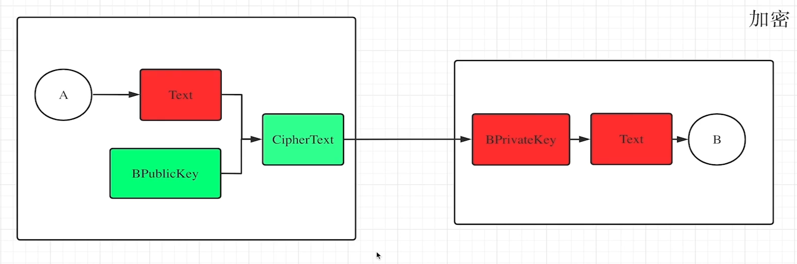
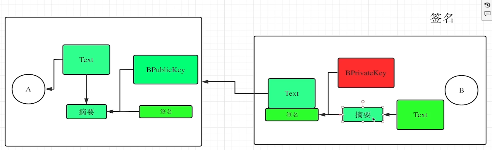
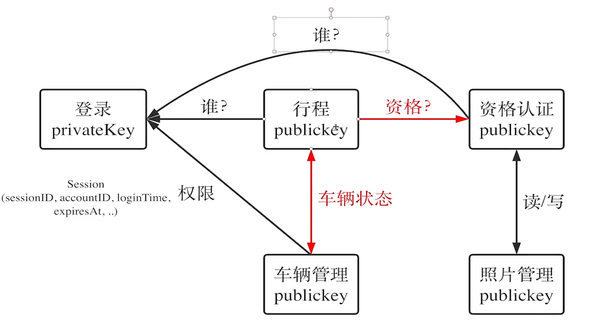

## 1、JWT简介

- 不需要维护状态数据
- 验证请求时，直接查验签名
- 安全性问题，有效期内无法及时关停账号，所以有效期比较短，一般2个小时。
- 介绍网站     https://jwt.io/

## 2、用RSA非对称密钥签名JWT

### 加密

A发送的信息，只有B能解。所以信息也是加密的。

### 签名

签名的作用：内容本身是公开的，但是要确定是我发出的，而不是别人伪造的，这时候用签名。就像我们写封信给别人签名一样。

红色：代表保密的信息，text代码明文没有加密的信息，例如jwt的前两部分。

RSA公钥、私钥生成网站：https://blackarch.org/crypto.html  

