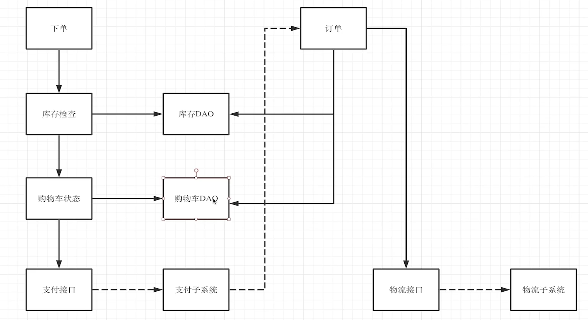

## 1、Context的概念

### 下单流程图

下单流程案例分析，不是真实的



不同的请求是不同的context。

如果不同的方法共用一个context，则他们是同一个任务的不同步骤。可以设置一个总的时间。

如果不同的方法是不同的context，通过context.Background()生成。则他们是不同的父子任务。可以单独设置限定时间。

一个request也可以看成是一个context，不同的请求可以通过context进行区分。

## 2、Context的示例

### 步骤

context约定是第一个参数。

```go
type paramKey struct{}

func main() {
	c := context.WithValue(context.Background(),
		paramKey{}, "abc") //不使用字符串“paramKey”的原因是使用类型可以复用，再使用的时候不需要再手写。
	mainTask(c)
}

func mainTask(c context.Context) {
	fmt.Printf("main task started with param %q\n", c.Value(paramKey{}))
	smallTask(c, "task1")
	smallTask(c, "task2")
}

func smallTask(c context.Context, name string) {
	fmt.Printf("%s started with param %q\n", name, c.Value(paramKey{}))
}
```

设置超时时间

```go
type paramKey struct{}

func main() {
	c := context.WithValue(context.Background(),
		paramKey{}, "abc") //不使用字符串“paramKey”的原因是使用类型可以复用，再使用的时候不需要再手写。
	//WithTimeout功能包含了withCancel()，会生成新的c,而不是修改原来的c
	c, cancel := context.WithTimeout(c, 5*time.Second)
	defer cancel() //超时或者调用cancel()方法都会停止任务。
	mainTask(c)
}

func mainTask(c context.Context) {
	fmt.Printf("main task started with param %q\n", c.Value(paramKey{}))
	smallTask(context.Background(), "task1")
	smallTask(c, "task2")
}

func smallTask(c context.Context, name string) {
	fmt.Printf("%s started with param %q\n", name, c.Value(paramKey{}))
	select {
	case <-time.After(6 * time.Second):
		fmt.Printf("%s done\n", name)
	case <-c.Done(): //cancel后或者5s后会收到信息
		fmt.Printf("%s cancelled\n", name)
	}
}
```

```go
func mainTask(c context.Context) {
	fmt.Printf("main task started with param %q\n", c.Value(paramKey{}))
	smallTask(c, "task1", 4*time.Second) //任务能做完
	smallTask(c, "task2", 2*time.Second) //任务不能做完，原因是main中设置了总共5s
}

func smallTask(c context.Context, name string, d time.Duration) {
	fmt.Printf("%s started with param %q\n", name, c.Value(paramKey{}))
	select {
	case <-time.After(d):
		fmt.Printf("%s done\n", name)
	case <-c.Done(): //cancel后或者5s后会收到信息
		fmt.Printf("%s cancelled\n", name)
	}
}
```

c1相当于一个子任务，但是携带参数，并且限定了时间2s，保证task2能够执行。

```go
func mainTask(c context.Context) {
	fmt.Printf("main task started with param %q\n", c.Value(paramKey{}))
	c1, cancel := context.WithTimeout(c, 2*time.Second)
	defer cancel()
	smallTask(c1, "task1", 4*time.Second)
	smallTask(c, "task2", 2*time.Second)
}

func smallTask(c context.Context, name string, d time.Duration) {
	fmt.Printf("%s started with param %q\n", name, c.Value(paramKey{}))
	select {
	case <-time.After(d):
		fmt.Printf("%s done\n", name)
	case <-c.Done(): //cancel后或者5s后会收到信息
		fmt.Printf("%s cancelled\n", name)
	}
}
```

### 子任务

```go
package main

import (
	"context"
	"fmt"
	"time"
)

type paramKey struct{}

func main() {
	c := context.WithValue(context.Background(),
		paramKey{}, "abc")
	c, cancel := context.WithTimeout(c, 10*time.Second)
	defer cancel()
	go mainTask(c)

	var cmd string
	for {
		fmt.Scan(&cmd)
		if cmd == "c" {
			cancel()
		}
	}
}

func mainTask(c context.Context) {
	fmt.Printf("main task started with param %q\n", c.Value(paramKey{}))
	go func() {
		c1, cancel := context.WithTimeout(context.Background(), 10*time.Second)
		defer cancel()  // 在 go func 结束时调用，而不是 mainTask结束，所以需要写到里边。
		smallTask(c1, "background_task", 9*time.Second)
	}()
	go func() {
    // 命令行输入c,也会结束当前任务。c1相当于c的一个子任务，继承了c的参数和超时时间。c超时，c1一定会被取消
		c1, cancel := context.WithTimeout(c, 10*time.Second)   
		defer cancel()
		smallTask(c1, "sub_task", 9*time.Second)
	}()
	smallTask(c, "same_task", 8*time.Second)
}

func smallTask(c context.Context, name string, d time.Duration) {
	fmt.Printf("%s started with param %q\n", name, c.Value(paramKey{}))
	select {
	case <-time.After(d):
		fmt.Printf("%s done\n", name)
	case <-c.Done():
		fmt.Printf("%s cancelled\n", name)
	}
}
```

### 后台任务

```go
func mainTask(c context.Context) {
	fmt.Printf("main task started with param %q\n", c.Value(paramKey{}))
	go func() {
    //后台任务,相当于一个全新的后台任务，不受c控制。
		c1, cancel := context.WithTimeout(context.Background(), 10*time.Second)
		defer cancel()  // 在 go func 结束时调用，而不是 mainTask结束，所以需要写到里边。
		smallTask(c1, "background_task", 9*time.Second)
	}()
	go func() {
    //子任务，受c的控制，也可以自己设置超时时间，相当于受两个超时时间控制。c1为c的子任务。
		c1, cancel := context.WithTimeout(c, 10*time.Second)   
		defer cancel()
		smallTask(c1, "sub_task", 9*time.Second)
	}()
	smallTask(c, "same_task", 8*time.Second)
}
```

## 3、创建TripService

前端请求

```typescript
 // 登录
wx.login({
  success: res => {
    console.log(res.code)
    // 发送 res.code 到后台换取 openId, sessionKey, unionId
    wx.request({
      url: 'http://localhost:8080/v1/auth/login',
      method: 'POST',
      data: {
        code: res.code
      } as auth.v1.ILoginRequest,
      success: res=>{
        const loginResp :auth.v1.ILoginResponse = auth.v1.LoginResponse.fromObject(
          camelcaseKeys(res.data as object)
        )
        console.log(loginResp)

        wx.request({
          url: 'http://localhost:8080/v1/trip',
          method: 'POST',
          data: {
            start: {
              latitude:100,
              longitude:20.33
            }
          } as rental.v1.ICreateTripRequest,
          header:{
            authorization:'Bearer'+loginResp.accessToken
          }
        })

      },
      fail: console.error
    })
  },
})
```

## 4、实现登陆状态拦截器
