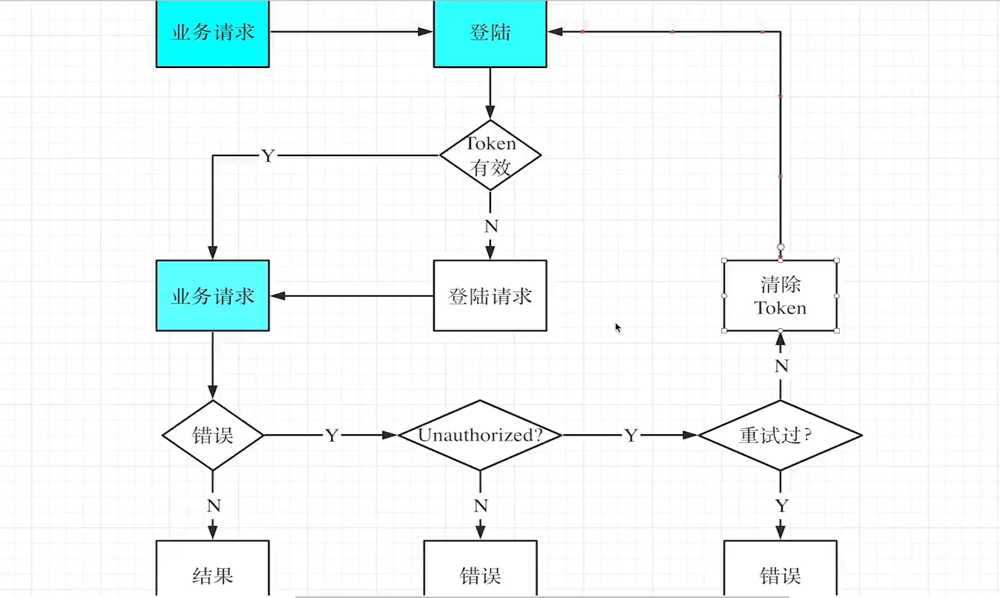

## 1、客户端携带token

```typescript
import camelcaseKeys from "camelcase-keys"
import { auth } from "./proto_gen/auth/auth_pb"
namespace Coolcar{
    export const serverAddr = 'http://localhost:8080'
    const AUTH_ERR = 'AUTH_ERR'

    const authData = {
        token: '',
        expiryMs: 0,
    }

   export interface RequestOption<REQ, RES> {
        method: 'GET'|'PUT'|'POST'|'DELETE'
        path: string
        data?: REQ
        respMarshaller: (r: object)=>RES
    }

    export interface AuthOption {
        attachAuthHeader: boolean
        retryOnAuthError: boolean
    }

    export async function login() {
        if (authData.token && authData.expiryMs >= Date.now()) {
            return
        }
        const wxResp = await wxLogin()
        const reqTimeMs = Date.now()
        const resp = await sendRequest<auth.v1.ILoginRequest, auth.v1.ILoginResponse> ({
            method: 'POST',
            path: '/v1/auth/login',
            data: {
                code: wxResp.code,
            },
            respMarshaller: auth.v1.LoginResponse.fromObject,
        }, {
            attachAuthHeader: false,
            retryOnAuthError: false,
        })
        authData.token = resp.accessToken!
        authData.expiryMs = reqTimeMs + resp.expiresIn! * 1000
    }


    function sendRequest<REQ, RES>(o: RequestOption<REQ, RES>, a: AuthOption): Promise<RES> {
        const authOpt= a|| {
            attachAuthHeader:true
        }
        return new Promise((resolve, reject) => {
            const header: Record<string, any> = {}
            if (authOpt.attachAuthHeader) {
                if (authData.token && authData.expiryMs >= Date.now()) {
                    header.authorization = 'Bearer ' + authData.token
                } else {
                    reject(AUTH_ERR)
                    return
                }
            }
            wx.request({
                url: serverAddr + o.path,
                method: o.method,
                data: o.data,
                header,
                success: res => {
                    resolve(o.respMarshaller(
                        camelcaseKeys(res.data as object, {
                            deep: true,  //内层结构也会转换驼峰命名
                        })))
                },
                fail: reject,
            })
        })
    }

    function wxLogin(): Promise<WechatMiniprogram.LoginSuccessCallbackResult> {
        return new Promise((resolve, reject) => {
            wx.login({
                success: resolve,
                fail: reject,
            })
        })
    }

}
```


## 2、客户端登陆的重试

### 流程图



### request.ts

```typescript
import camelcaseKeys from "camelcase-keys"
import { auth } from "./proto_gen/auth/auth_pb"
export namespace Coolcar{
    export const serverAddr = 'http://localhost:8080'
    export const wsAddr = 'ws://81.69.182.228'
    const AUTH_ERR = 'AUTH_ERR'

    const authData = {
        token: '',
        expiryMs: 0,
    }

    export interface RequestOption<REQ, RES> {
        method: 'GET'|'PUT'|'POST'|'DELETE'
        path: string
        data?: REQ
        respMarshaller: (r: object)=>RES
    }

    export interface AuthOption {
        attachAuthHeader: boolean
        retryOnAuthError: boolean
    }

    export async function sendRequestWithAuthRetry<REQ, RES>(o: RequestOption<REQ, RES>, a?: AuthOption): Promise<RES> {
        const authOpt = a || {
            attachAuthHeader: true,
            retryOnAuthError: true,
        }
        try {
            await login()
            return sendRequest(o, authOpt)
        } catch(err) {
            if (err === AUTH_ERR && authOpt.retryOnAuthError) {
                authData.token = ''
                authData.expiryMs = 0
                return sendRequestWithAuthRetry(o, {
                    attachAuthHeader: authOpt.attachAuthHeader,
                    retryOnAuthError: false,
                })
            } else {
                throw err
            }
        }
    }

    export async function login() {
        if (authData.token && authData.expiryMs >= Date.now()) {
            return
        }
        const wxResp = await wxLogin()
        const reqTimeMs = Date.now()
        const resp = await sendRequest<auth.v1.ILoginRequest, auth.v1.ILoginResponse> ({
            method: 'POST',
            path: '/v1/auth/login',
            data: {
                code: wxResp.code,
            },
            respMarshaller: auth.v1.LoginResponse.fromObject,
        }, {
            attachAuthHeader: false,
            retryOnAuthError: false,
        })
        authData.token = resp.accessToken!
        authData.expiryMs = reqTimeMs + resp.expiresIn! * 1000
    }

    function sendRequest<REQ, RES>(o: RequestOption<REQ, RES>, a: AuthOption): Promise<RES> {
        return new Promise((resolve, reject) => {
            const header: Record<string, any> = {}
            if (a.attachAuthHeader) {
                if (authData.token && authData.expiryMs >= Date.now()) {
                    header.authorization = 'Bearer ' + authData.token
                } else {
                    reject(AUTH_ERR)
                    return
                }
            }
            wx.request({
                url: serverAddr + o.path,
                method: o.method,
                data: o.data,
                header,
                success: res => {
                    if (res.statusCode === 401) {
                        reject(AUTH_ERR)
                    } else if (res.statusCode >= 400) {
                        reject(res)
                    } else {
                        resolve(o.respMarshaller(
                            camelcaseKeys(res.data as object, {
                                deep: true,
                            })))
                    }
                },
                fail: reject,
            })
        })
    }

    function wxLogin(): Promise<WechatMiniprogram.LoginSuccessCallbackResult> {
        return new Promise((resolve, reject) => {
            wx.login({
                success: resolve,
                fail: reject,
            })
        })
    }

    export interface UploadFileOpts {
        localPath: string
        url: string
    }
    export function uploadfile(o: UploadFileOpts): Promise<void> {
        const data = wx.getFileSystemManager().readFileSync(o.localPath)
        return new Promise((resolve, reject) => {
            wx.request({
                method: 'PUT',
                url: o.url,
                data,
                success: res => {
                    if (res.statusCode >= 400) {
                        reject(res)
                    } else {
                        resolve()
                    }
                },
                fail: reject,
            })
        })
    }
}
```

### trip.ts

```typescript
import { rental } from "./proto_gen/rental/rental_pb";
import { Coolcar } from "./request";

export namespace TripService {
    export function createTrip(req: rental.v1.ICreateTripRequest): Promise<rental.v1.ITripEntity> {
        return Coolcar.sendRequestWithAuthRetry({
            method: 'POST',
            path: '/v1/trip',
            data: req,
            respMarshaller: rental.v1.TripEntity.fromObject,
        })
    }
}
```

### lock.ts

```typescript
onUnlockTap(){
  wx.getLocation({
    type: 'gcj02',
    success: loc => {
      console.log('start a trip',{
        location:{
          latitude: loc.latitude,
          longitude: loc.latitude
        },
        //TODO 需要双向绑定
        avatarURL:this.data.shareLocation ? this.data.avatarURL:'',
      })
      const tripID = 'trip456'

      TripService.createTrip({
        start:{
          latitude:20.344,
          longitude:39.9999,
        }
      })

      wx.showLoading({
        title:'开锁中',
        mask:true
      })
      setTimeout(() => {
        wx.redirectTo({
          //url:`/pages/driving/driving?trip_id=${tripID}`,
          url:routing.drving({
            trip_id:tripID
          }),
          complete:()=>{
            wx.hideLoading()
          } 
        })
      }, 2000);
    },
    fail: () => {
      wx.showToast({
        icon: 'none',
        title: '请前往设置页授权位置信息。'  //用户点击了取消授权后，可以在设置里重新修改
      })
    }
  })   
}
```

