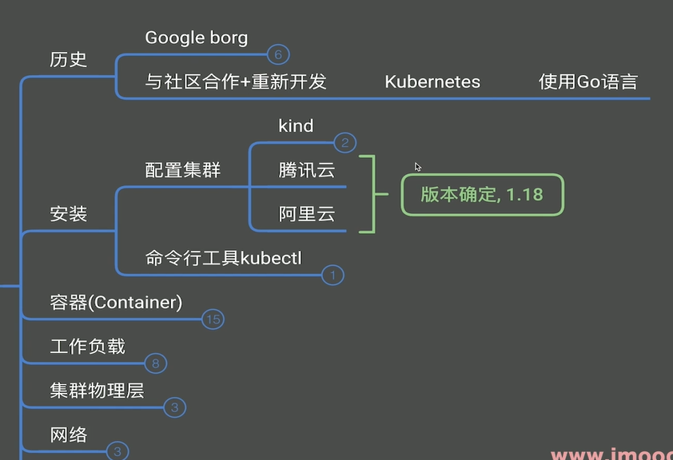
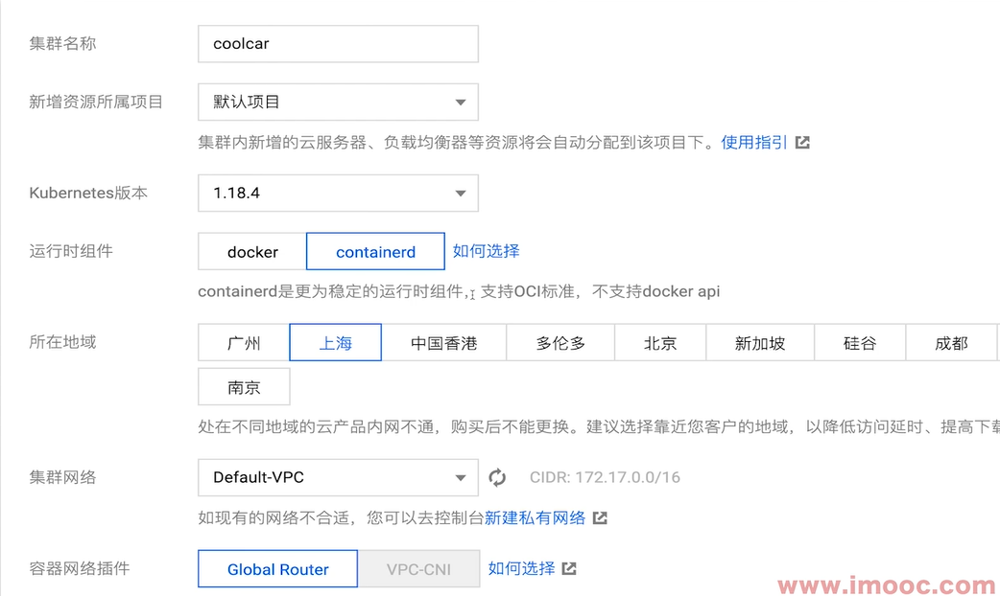
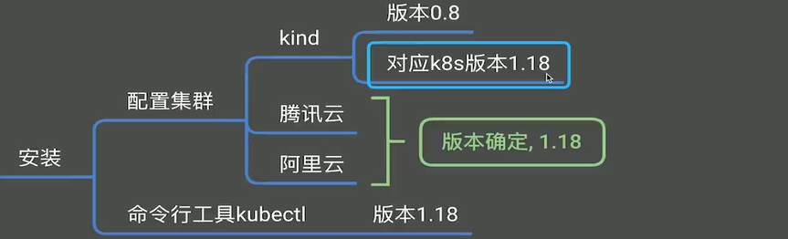
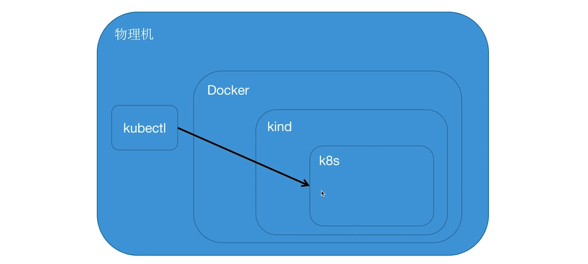
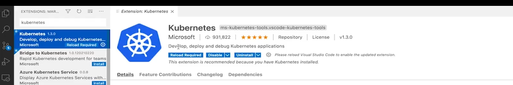
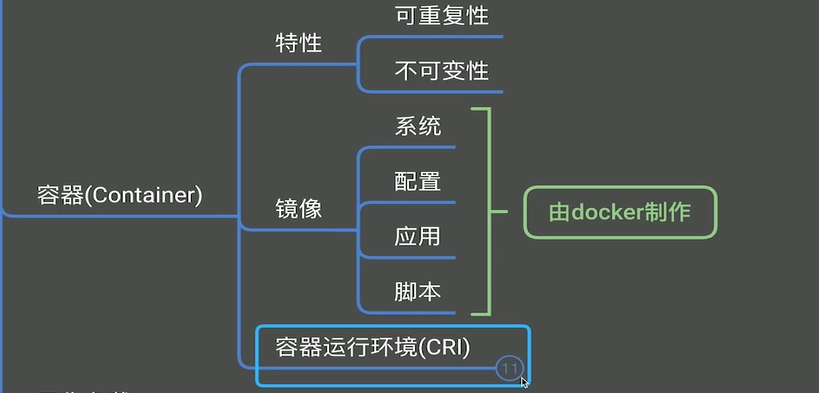
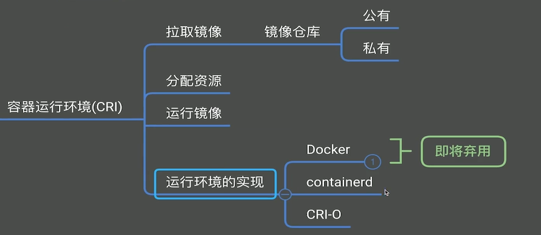
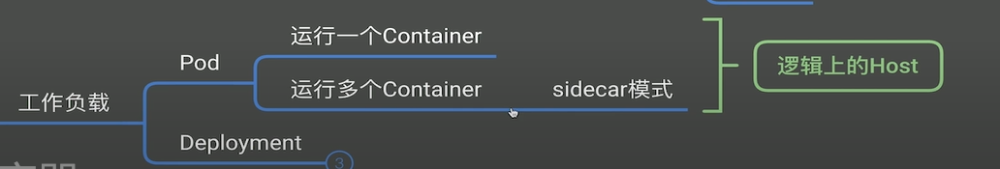
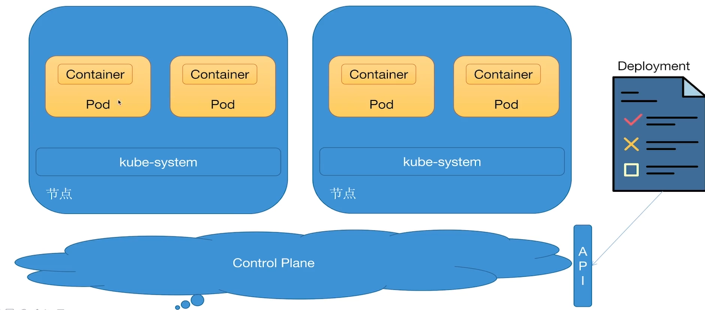
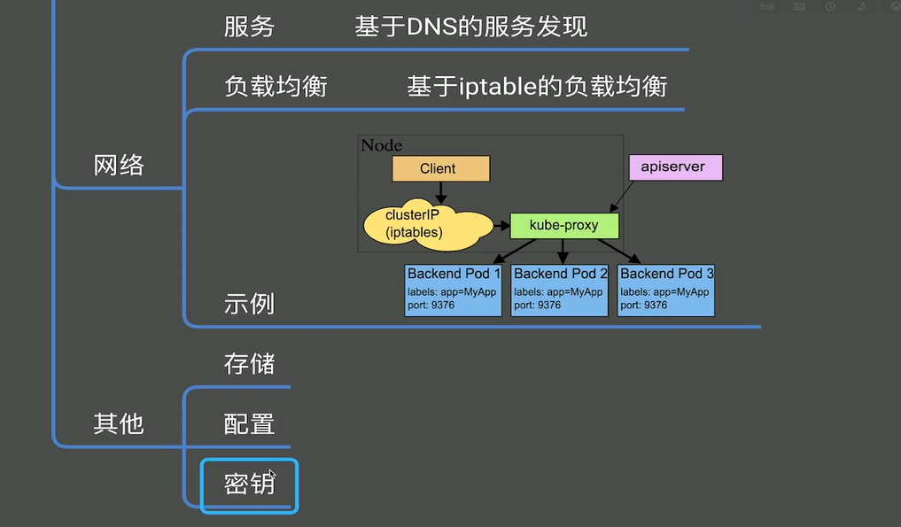

## 1、集群的配置及版本

### 简介

kind用于本机进行k8s集群练习，k8s的版本由云厂商决定。

### 腾讯云安装

云产品-->集群

运行时组件选 containerd，docker已经被弃用。




## 2、kubectl的安装

https://kubernetes.io/docs/tasks/tools/install-kubectl-windows/    kubectl 安装包文档说明页面。

下载：https://dl.k8s.io/release/v1.18.0/bin/windows/amd64/kubectl.exe      版本号可以修改。

然后将可执行文件目录添加PATH目录。


## 3、用kind来配置本地集群

还有其他的工具，例如minikube

Kind 是 kubernetes in docker 的简写。kubernetes in docker  is  not using docker。（k8s运行的容器并没有使用docker，但是k8s本身部署在docker之上）

官网：https://kind.sigs.k8s.io/

[release notes]   https://github.com/kubernetes-sigs/kind/releases  有kind 与 k8s版本对应关系。

If you have [go](https://golang.org/) ([1.17+](https://golang.org/doc/devel/release.html#policy)) and [docker](https://www.docker.com/) installed `go install sigs.k8s.io/kind@v0.11.1 && kind create cluster` is all you need!

安装 Kind 之前需要先有 Go 和 Docker环境。Kind 镜像是运行在docker服务之上的。

在项目的 go.mod 同级目录 使用 go get命令安装kind,只有是在mod项目中才能使用go get 命令

```shell
go get sigs.k8s.io/kind@v0.8.0
```

Kind 会被安装在gopath 的bin 目录下面，将bin目录添加到Path 环境变量，就可以直接在控制台使用 kind命令。

```shell
#创建集群
kind create cluster
```

整个结构是 kind 镜像里边 运行的 k8s 集群。

为了系统运行的更流程，建议给Docker服务分配更多的CPU,内存空间。

## 4、用kubectl来连接集群

查看集群信息命令：kubectl  cluster-info  --context kind-kind  或者 没有context,直接使用  kubectl  cluster-info

查看版本命令：	kubectl   version

腾讯云 k8s集群访问

1、基本信息里边开通外网访问权限

2、下载配置文件 cls-f5ukhgwj-config

3、重命名为  qcloud-coolcar-config

4、 export KUBECONFIG = ~/Downloads/qcloud-coolcar-config  

​		windows 用 set %KUBECONFIG%=~/Downloads/qcloud-coolcar-config  


vscode 插件管理：添加config，可以查看k8s信息




查看 kind 集群

kind get kubeconfig  将内容保存到文件，然后使用插件访问。


设置环境变量后，kubctl访问腾讯云

export KUBECONFIG = ~/Downloads/qcloud-coolcar-config  

kubectl  cluster-info

清除后，访问本机kind

unset   KUBECONFIG 

kubectl  cluster-info

## 5、容器

### 基本操作

```yaml
apiVersion: apps/v1
kind: Deployment
metadata:
  name: nginx-deployment
  labels:
    app: nginx
spec:
  replicas: 4
  selector:
    matchLabels:
      app: nginx
  template:
    metadata:
      labels:
        app: nginx
    spec:
      containers:
      - name: nginx
        image: nginx
        ports:
        - containerPort: 80
        resources:
          limits:
            cpu: 100m
            memory: 128Mi
```

yaml配置文件一般拷贝修改，很少手写。

启动容器：kubectl apply -f nginx/nginx-deployment.yaml

查看:		  kubectl get pods				 查看指定命名空间：kubectl get pods  -n  kube-system

### 架构

可重复性、不可变性（镜像不可修改，只能发布新版本）

CRI:容器运行接口







k8s只是操作抽象的接口，需要的只是一个镜像，镜像是由Docker制作还是其他工具制作并不关心。所以Docker弃用并不影响K8s。

我们制作镜像的时候可以使用Docker制作，具体运行的时候容器是docker还是containerd，开发者不需要关心。


### 工作负载

Pod是逻辑上的Host(主机)，类似一个虚拟机，可以通过腾讯云的后台登录。一般情况下一个Pod运行一个容器。

运行多个容器的情况一般是使用sidecar模式增强，例如服务网格 istio



Deployment是一个描述，包含：镜像、参数、资源（cpu,memory）

使用命令进入Pod,  -it表示将Pod的输入输出导入到当前中断。

```shell
kubectl exec -it nginx-deployment-76f8sljs0-mvsl  -- /bin/bash
curl localhost
```

## 6、节点及物理层

节点就是真实的物理机，可以向集群中添加节点。




## 7、服务与网络

```yaml
apiVersion: v1
kind: Service
metadata:
  name: nginx-service
spec:
  selector:
    app: nginx    #会将请求转发给标有 app:nginx 标签的Pod
  ports:
    - protocol: TCP
      port: 80
```

查看服务命令：kubectl get svc

会看到服务的地址，但是是集群内网地址无法访问。所以需要 

```shell
#1.进入Pod内部
kubectl exec -it nginx-deployment-76f8sljs0-mvsl  -- /bin/bash
#2.请求service,通过内部的dns解析
curl nginx-service
```




腾讯云弹性集群，是按使用时间计费的，使用完之后将Pod删除，以免产生费用

命令： 	kubectl delete deployment --all

