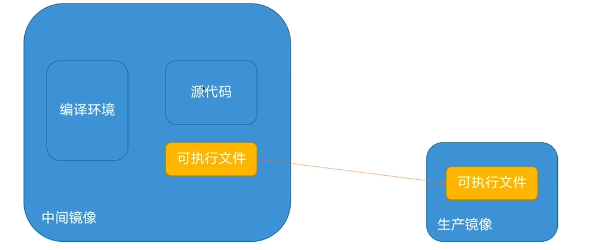
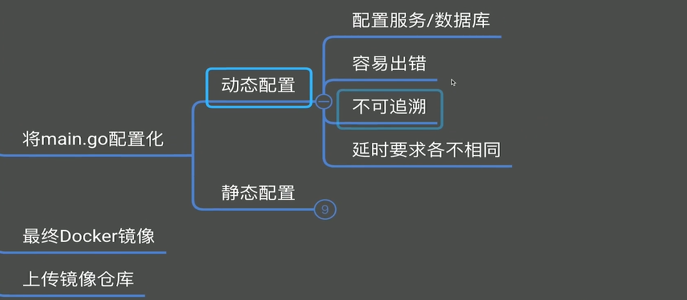
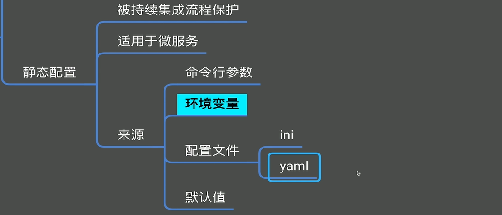
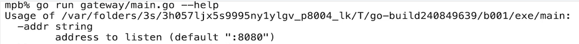
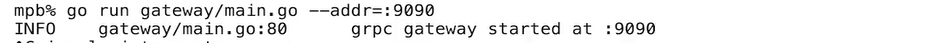

## 1、构建Docker镜像

### 制作服务镜像

容器状态改变后，根据容器制作镜像命令：	docker commit    container_id	alpine_1

步骤：编译、选择基础镜像、拷贝编译后的可执行文件、设置环境


```shell
#生成打包文件
go install ./gateway/...
#进入 gopath目录 可以看到打包后的 gateway
ls ~/go/bin
#为了不污染工作机,并且防止本机打包的程序无法在容器中运行，所以一般在Docker镜像中编译
rm ~/go/bin/gateway
#运行带有go环境的镜像
docker run -it golang:1.15
#修改go evn 配置
go env
go env -w GO111MODDULE=on
go env -w GOPROXY=https://goproxy.cn,direct
#然后拷贝项目源码到src目录，然后go install


```

```shell
#下面是采用Dockerfile自动完成构建
#deployment目录新建gateway目录，然后新建文件Dockerfile

# 启动编译环境
FROM golang:1.15

# 配置编译环境
RUN go env -w GO111MODULE=on
RUN go env -w GOPROXY=https://goproxy.cn,direct

# 拷贝源代码到镜像中,当前目录为server
COPY . /go/src/coolcar/server

# 编译
WORKDIR /go/src/coolcar/server
RUN go install ./gateway/...

# 申明暴露的端口，不然容器外无法访问，并不是真正的暴露，只是声明
# 使用 docker ps 命令查看，可以看到容器暴露的端口信息  8080/tcp
EXPOSE 8080

# 设置服务入口
ENTRYPOINT [ "/go/bin/gateway" ]
```

```shell
#在server目录下面, -t指定镜像名,最后面的.指定Dockerfile当前目录为具体哪个目录
docker build -t coolcar/gateway -f ../deployment/gateway/Dockerfile .
#服务不需要-it,服务是不会退出的
docker run coolcar/gateways
#在vscode使用插件 attach shell 或者 使用命令 docker exec -it  进入docker容器内部。
```


## 2、Dockerfile指令详解

```shell
#需要指定端口映射，才能访问
docker run -p 8080:8080 coolcar/gateways
# ENTRYPOINT 和CMD 会拼在一起执行，ENTRYPOINT CMD
ENTRYPOINT [ "echo",a ]
CMD ["b"]
#执行的命令是 echo a b
a b
#CMD 是可以更改的,用来重写，ENTRYPOINT是固定的，例如 docker run -p 8080:8080 coolcar/gateways c d e
a c d e
```


## 3、为Docker镜像瘦身

编译在编译镜像里进行，需要有Go编译环境，生产不需要，生产只需要linux系统+Go可执行文件就可以。所以采用alpine做为基础镜像，alpine大小只有几M。



```dockerfile
#在golang系统编译的文件无法在alpine系统中运行，所以需要加参数控制,例如编译成exe可执行文件。
RUN GOOS=windows go install ./gateway/...
#编译可以在alpine运行的文件
RUN CGO_ENABLED=0  GOOS=linux go install ./gateway/...
#直接使用 golang:1.15-alpine 进行编译，编译出来的文件一定可以在alpine系统运行
FROM golang:1.15-alpine
```

多阶段编译

```dockerfile
# 启动编译环境,只是编译镜像，并不是用来生成最终镜像
FROM golang:1.15-alpine AS builder

# 配置编译环境
RUN go env -w GO111MODULE=on
RUN go env -w GOPROXY=https://goproxy.cn,direct

# 拷贝源代码到镜像中
COPY . /go/src/coolcar/server

# 编译
WORKDIR /go/src/coolcar/server
RUN go install ./gateway/...

#生成最终镜像的基础镜像，已经跟Go语言脱离关系了，只是一个很小的linux系统
FROM alpine:3.13
#从编译镜像builder中拷贝文件到alpine镜像
COPY --from=builder /go/bin/gateway /bin/gateway
ENV ADDR=:8080

# 申明暴露的端口
EXPOSE 8080

# 设置服务入口
ENTRYPOINT [ "/bin/gateway" ]
```


## 4、flag与环境变量的使用

### 概念介绍

动态配置：可以在程序运行中，由运维人员直接修改，不需要重启服务

静态配置：需要重新发布程序。




静态配置读取配置的优先级是从上到下，优先使用命令行的配置。




### 命令行参数使用

```go
var addr = flag.String("addr", ":8080", "address to listen") //第三个参数是帮助信息

func main() {
	flag.Parse() //一定不能漏掉
   
	lg.Sugar().Infof("grpc gateway started at %s", *addr)
	lg.Sugar().Fatal(http.ListenAndServe(*addr, nil))
}
```


使用 **-- help** 会打印帮助信息







### 环境变量

环境变量原本并不提倡，使用环境变量很容易影响已有的环境变量，不容易区分是哪个应用在使用该环境变量，但是k8s的世界里对环境变量的支持特别好。k8s 里每个容器都是独立的，不同的应用不会互相冲突。

在k8s中，环境变量反而成为最顺手的配置，**上图高亮显示**。

```yaml
apiVersion: apps/v1
kind: Deployment
metadata:
  name: nginx-deployment
  labels:
    app: nginx
spec:
  replicas: 4
  selector:
    matchLabels:
      app: nginx
  template:
    metadata:
      labels:
        app: nginx
    spec:
      containers:
      - name: nginx		# - 表示数组
        image: nginx
        ports:
        - containerPort: 80
        env:		#环境变量写法（更简单）
        - name: ADDR
          VALUE: :8080
        args:		#命令行参数写法，写法不灵活，没法从配置中读取。
        - "--addr=:8080"
        resources:
          limits:
            cpu: 100m
            memory: 128Mi
```

使用第三方库可以同时支持多种方式读取配置。

go get  github.com/namsral/flag

```go
//更换引用即可从环境变量读取配置
import (
	"github.com/namsral/flag"
)
```

