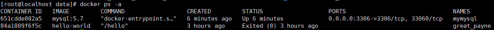
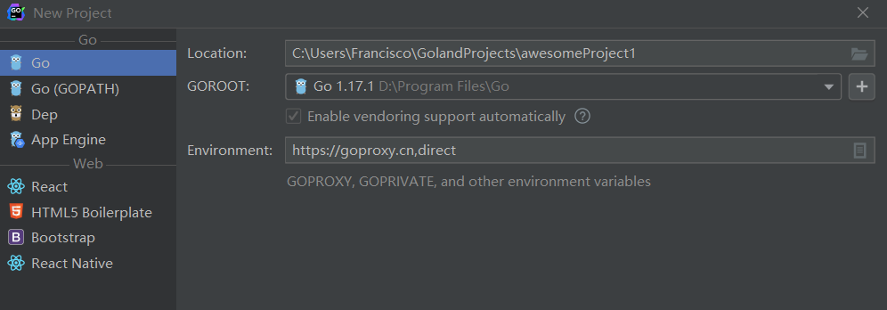

## 1、课程目标

1. go语言开发流行的电商系统

   为什么电商：电商系统具备完整的微服务开发细节

2. 理解微服务的所有细节——从0到1实现

   为什么从0到1：自研能帮我们理解透彻很多细节，go语言没有大一统的微服务框架，不像java有springcloud。

   go语言在微服务领域发展很快，框架很多，没有哪个框架有发展成统领的趋势。

3. 分布式系统核心问题——分布式锁、分布式事务。

   

## 2、开发环境介绍


## 3、Windows安装centos7虚拟机

1. 安装virtualbox

   下载地址：https://www.virtualbox.org/wiki/Download_Old_Builds_6_0 （下载最新版本，不然可能无法兼容最新版本的centos7）

   选择：		windows hosts

2. 安装centos

   阿里云开源镜像站：http://mirrors.aliyun.com/

   选择路径：				https://mirrors.aliyun.com/centos/7/isos/x86_64/

   下载镜像：				CentOS-7-x86_64-DVD-2009.iso

3. 安装centos，网络选择桥接。主机与虚拟机之间要互相ping通。

4. 桥接网卡--Wireless LAN

## 4、linux Git 安装

1. yum install git

2. git config --global user.name "zxz"

3. git config --global user.email "zxz@gmail.com"

4. git config --global --list

   

## 5、安装docker 和 docker-compose

### 1、安装docker

1. 安装

   ```shell
   curl -fsSL  https://get.docker.com	| bash -s docker --mirror	Aliyun
   ```

2. 设置开机启动docker

   ```shell
   systemctl enable docker
   ```

3. 测试

   ```shell
   docker ps -a
   输出：Cannot connect to the Docker daemon at unix:///var/run/docker.sock. Is the docker daemon running?
   #说明docker服务没有启动，再次使用命令检测。
   ps -ef | grep docker
   ```

4. 启动docker

   ```shell
   systemctl start docker
   ```

### 2、配置阿里云镜像

登录阿里云——控制台——产品与服务——容器镜像服务——镜像加速器

```shell
sudo mkdir -p /etc/docker
sudo tee /etc/docker/daemon.json <<-'EOF'
{
  "registry-mirrors": ["https://fqi6q4c6.mirror.aliyuncs.com"]
}
EOF
sudo systemctl daemon-reload
sudo systemctl restart docker
```

### 3、启动

```shell
sudo systemctl start docker
```

### 4、测试一下

```shell
sudo docker run hello-world

#输出下面信息说明启动容器启动成功
Unable to find image 'hello-world:latest' locally
latest: Pulling from library/hello-world
2db29710123e: Pull complete 
Digest: sha256:2498fce14358aa50ead0cc6c19990fc6ff866ce72aeb5546e1d59caac3d0d60f
Status: Downloaded newer image for hello-world:latest

Hello from Docker!
```

### 5、删除容器

```sh
docker rm 容器ID
```


### 6、安装docker-compose

1. 下载

   ```shell
   # 国内镜像地址
   curl -L https://get.daocloud.io/docker/compose/releases/download/1.25.0/docker-compose-`uname -s`-`uname -m` > /usr/local/bin/docker-compose
   
   # 下载完之后可以看下 /usr/local/bin 这个目录有没有 docker-compose 这个文件
   ```

2. 授权

   ```shell
   # 给docker compose 目录授权
   sudo chmod +x /usr/local/bin/docker-compose
   
   # 查看一下version，显示有版本号那就说明安装成功了
   docker-compose version  或者	docker-compose -v
   ```

   

## 6、安装mysql

1. 下载镜像

   ```shell
   docker pull mysql:5.7
   ```

2. 通过镜像启动docker

   ```shell
   docker run -p 3306:3306 --name mymysql -v  $PWD/conf:/etc/mysql/conf.d -v $PWD/logs:/logs -v $PWD/data:/var/lib/mysql -e MYSQL_ROOT_PASSWORD=123456 -d mysql:5.7
   
    # -v $PWD/data:/var/lib/mysql 将主机当前目录下的data目录挂载到容器内部的/var/lib/mysql，这样主机的data目录就指向了容器内部的/var/lib/mysql目录。这样就能通过主机查看容器内的目录文件了。
   ```

3. 查看容器

   

   STATUS:UP  表示容器内服务正在运行。

4. 如果是Exited退出状态，证明容器启动出错了，通过 docker logs 容器ID 查看日志。

5. 进入容器内配置

   由于mysql的安全策略，现在还不能用root/123456来访问数据库

   ```shell
   #进入容器
   docker exec  -it 651cdde082a5 /bin/bash
   #进入mysql
   mysql -uroot -p123456
   # 表示有所有的权限，除了grant这个命令，这个命令是root才有的。此处密码被修改成了root
   grant all privileges  on *.* to 'root'@'%' identified by 'root' with grant option;
   grant all privileges  on *.* to 'root'@'127.0.0.1' identified by 'root' with grant option;
   grant all privileges  on *.* to 'root'@'localhost' identified by 'root' with grant option;
   flush privileges
   ```

6. 输入两次 exit 先退出mysql,再退出容器。

## 7、windows下安装go 和 goland

### go环境安装

建议去go语言中文网下载，网址：https://studygolang.com/dl

直接下载安装包安装，windows下安装后会自动添加环境变量。

### go依赖包仓库地址修改

国外的地址，go get 在进行安装的时候会比较慢，使用命令修改

go env -w  GOPROXY=https://goproxy.cn,direct  或者 https://goproxy.io,direct

go env -w GO111MODULE=on	(打开module模式)

### goland 安装

为了重启goland方便，安装过程中勾选 Update Path  Variable (restart needed)

### goland 破解

一、插件方式（稳定）
链接：https://pan.baidu.com/s/16NxZAJJzCmOHfwu1uOfGBg
提取码：TTTT
二、激活码方式（每天早上更新一次，不稳定，基本半天下午就会失效）
1、用浏览器打开网址: vrg123.com
2、在网址上输入密钥：4565

### goland 代码自动格式化

1、setting——tools——File Watchers——新增 go fmt

2、安装goimports 	go get golang.org/x/tools/cmd/goimports	 **(如果本地已经存在，不需要再次安装)**

3、新增 goimports

### goland 新建项目

环境变量需要填修改后的仓库地址



测试

新建文件，粘贴 gin代码，选择Sync dependencies of awesomeProject，goland会自动下载 gin 包。

```go
package main

import "github.com/gin-gonic/gin"

func main() {
	r := gin.Default()
	r.GET("/ping", func(c *gin.Context) {
		c.JSON(200, gin.H{
			"message": "pong",
		})
	})
	r.Run() // listen and serve on 0.0.0.0:8080 (for windows "localhost:8080")
}
```

## 8、linux 安装go

```shell
#下载安装包
wget https://dl.google.com/go/go1.15.3.linux-amd64.tar.gz
#解压安装 执行tar解压到/usr/loacl目录下，得到go文件夹
tar -C /usr/local -zxvf  go1.15.3.linux-amd64.tar.gz

#添加/usr/loacl/go/bin目录到PATH变量中。添加到/etc/profile 或$HOME/.profile都可以

vim /etc/profile   或者 ~/.bashrc
# 在最后一行添加
export GOROOT=/usr/local/go
export GOPATH=/root/projects/go   #一定不能配置成 /usr/local/go/src
export PATH=$PATH:$GOROOT/bin:$GOPATH/bin
# wq保存退出后source一下
source /etc/profile  或者 ~/.bashrc
```

```
bashrc和profile的差异在于：
1. bashrc是在系统启动后就会自动运行。
2. profile是在用户登录后才会运行。
3. 进行设置后，可运用source bashrc命令更新bashrc，也可运用source profile命令更新profile。
PS：通常我们修改bashrc,有些linux的发行版本不一定有profile这个文件。
4. /etc/profile中设定的变量(全局)的可以作用于任何用户，而~/.bashrc等中设定的变量(局部)只能继承/etc/profile中的变量，他们是"父子"关系
```

## 9、node 安装

### windows安装

直接通过安装包安装，安装之后会自动添加到环境变量。

修改为国内镜像： npm install -g  cnpm  --registry=https://registry.npm.taobao.org

之后使用 cnpm命令代替 npm ，也可以参考之前前端项目里直接对npm的镜像地址进行修改。 

 cnpm -v 严重安装是否成功。


### linux安装

下载

wget  https://npmmirror.com/mirrors/node/v16.13.2/node-v16.13.2-linux-x64.tar.xz

解压

tar -xvf node-v16.13.2-linux-x64.tar.xz 

建立软连接

```shell
ln -s /root/node-v16.13.2-linux-x64/bin/node   /usr/bin/node  
ln -s /root/node-v16.13.2-linux-x64/bin/npm   /usr/bin/npm
```


## 10、代码提示神器-kite的安装与配置

https://www.kite.com/ —— Download for Free—— 安装KiteSetup

kite是一个独立的进程，能自动集成到 IDE 中。


安装过程中，会自动检测IDE,然后根据IDE安装对应的插件Plugin。