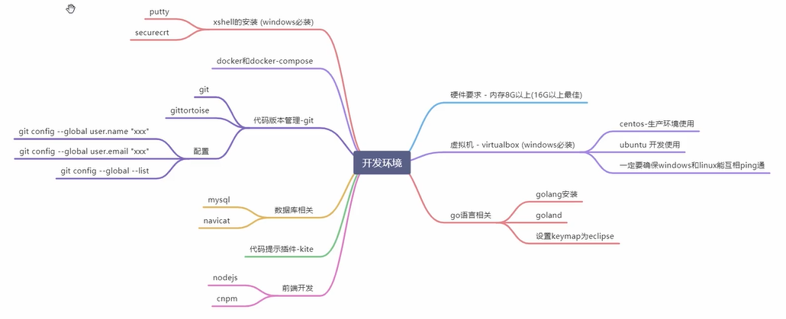

## 1、课程目标

1. go语言开发流行的电商系统

   为什么电商：电商系统具备完整的微服务开发细节

2. 理解微服务的所有细节——从0到1实现

   为什么从0到1：自研能帮我们理解透彻很多细节，go语言没有大一统的微服务框架，不像java有springcloud。

   go语言在微服务领域发展很快，框架很多，没有哪个框架有发展成统领的趋势。

3. 分布式系统核心问题——分布式锁、分布式事务。

   

## 2、开发环境介绍

## 3、Windows安装centos7虚拟机

1. 安装virtualbox

   下载地址：https://www.virtualbox.org/wiki/Download_Old_Builds_6_0 （下载最新版本，不然可能无法兼容最新版本的centos7）

   选择：		windows hosts

2. 安装centos

   阿里云开源镜像站：http://mirrors.aliyun.com/

   选择路径：				https://mirrors.aliyun.com/centos/7/isos/x86_64/

   下载镜像：				CentOS-7-x86_64-DVD-2009.iso

3. 安装centos，网络选择桥接。主机与虚拟机之间要互相ping通。

## 4、linux Git 安装

1. yum install git
2. git config --global user.name "zxz"
3. git config --global user.email "zxz@gmail.com"
4. git config --global --list