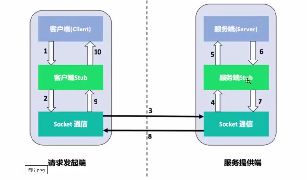

## 1、gopath开发模式和go modules开发模式对比

### gopath介绍

早期项目需要建立在gopath目录下的src目录里面。



新建目录，引入项目内包会报错，解决办法是  go env -w GO111MODULE = off


1. **一定要将代码新建到gopath目录之下的src**
2. **要记得设置GO111MODULE=off, 开始go modules要记得GO111MODULE=on**

先查找 gopath/src 这个目录之下的包是否有 goroot/src目录之下找
其实就是不做包管理

 包管理 - 异常处理 泛型

能用go modules就用modules 不用去考虑以前的开发模式
即使你使用了以前的模式 也可以自动设置为现在的modules模式
 go modules是一个统一的做法


### 老项目修改为 go module

将项目拷贝到其他目录，并修改为GO Module项目

打开项目——Setting——Go——Go Module——Enable Go Module 并填写environment

手动新建go.mod文件

```go
module OldPackageTest

go 1.14
```


### 引入第三方包

直接 import ，然后通过IDE的Sync 自动下载安装到本地，安装路径为gopath/pkg/mod目录。

第三方包信息会自动添加到go.mod。也可以通过手工修改go.mod 文件里的版本信息，然后IDE会自动下载相应的版本。


## 2、Go编码规范

### 为什么需要代码规范

1. 代码规范不是强制性的，也就是你不遵循代码规范写出来的代码运行也是完全没有问题的
2. 代码规范方便团队形成一个统一的代码风格，提高代码的可读性，规范性和统一性。本规范将从命名规范，注释规范，代码风格和 Go 语言提供的常用的工具这几个方面做一个说明。
3. 规范并不是唯一的，也就是说理论上每个公司都可以制定自己的规范，不过一般来说整体上规范差异不会很大。


### 代码规范

#### 1、命名规范

命名是代码规范中很重要的一部分，统一的命名规则有利于提高的代码的可读性，好的命名仅仅通过命名就可以获取到足够多的信息。

- 当命名（包括常量、变量、类型、函数名、结构字段等等）以一个大写字母开头，如：Group1，那么使用这种形式的标识符的对象就**可以被外部包的代码所使用**（客户端程序需要先导入这个包），这被称为导出（像面向对象语言中的 **public**）。
- 命名如果以小写字母开头，则对包外是不可见的，但是他们在整个包的内部是可见并且可用的（像面向对象语言中的 **private** ）。

##### 1.1 包名：package

保持package的名字和目录保持一致，尽量采取有意义的包名，简短，有意义，尽量和标准库不要冲突。包名应该为小写单词，不要使用下划线或者混合大小写。

```go
package demo
package main
```

##### 1.2  文件名

尽量采取有意义的文件名，简短，有意义，应该为小写单词，使用下划线分隔各个单词（蛇形命名法）。

```go
my_test.go
user_model.go
```

##### 1.3 结构体命名

- 采用驼峰命名法，首字母根据访问控制大写或者小写。
- struct 申明和初始化格式采用多行，例如下面：

```go
// 多行申明
type User struct{
    Username  string  //Username比较常用，能分的清是两个单词，所以没使用大写字母标识。
    Email     string
}

// 多行初始化
u := User{
    Username: "avatar",
    Email:    "avatar@gmail.com",
}
```

##### 1.4 接口命名

- 命名规则基本和上面的结构体类型。
- 单个函数的结构名以 “er” 作为后缀，例如 Reader , Writer 。

```go
type Reader interface {
        Read(p []byte) (n int, err error)
}
```

##### 1.5 变量命名

- 和结构体类似，变量名称一般遵循驼峰法，首字母根据访问控制原则大写或者小写，但遇到特有名词时，需要遵循以下规则：
- 如果变量为私有，且特有名词为首个单词，则使用小写，如 apiClient
- 其它情况都应当使用该名词原有的写法，如 APIClient、repoID、UserID
- 错误示例：UrlArray，应该写成 urlArray 或者 URLArray
- 若变量类型为 bool 类型，则名称应以 Has, Is, Can 或 Allow 开头

```go
var isExist bool
var hasConflict bool
var canManage bool
var allowGitHook bool
```

##### 1.6 常量命名

常量均需使用全部大写字母组成，并使用下划线分词。

```go
const APP_VER = "1.0"
```

如果是枚举类型的常量，需要先创建相应类型：

```go
type Scheme string
const (
    HTTP  Scheme = "http"
    HTTPS Scheme = "https"
)
```

#### 2、注释

Go提供C风格的/ /块注释和C 风格的//行注释。行注释是常态；块注释主要显示为包注释，但在表达式中很有用或禁用大量代码。

- 单行注释是最常见的注释形式，你可以在任何地方使用以 // 开头的单行注释
- 多行注释也叫块注释，均已以 / 开头，并以 / 结尾，且不可以嵌套使用，多行注释一般用于包的文档描述或注释成块的代码片段

go 语言自带的 godoc 工具可以根据注释生成文档，可以自动生成对应的网站（ http://golang.org 就是使用 godoc 工具直接生成的），注释的质量决定了生成的文档的质量。每个包都应该有一个包注释，在package子句之前有一个块注释。对于多文件包，包注释只需要存在于一个文件中，任何一个都可以。包评论应该介绍包，并提供与整个包相关的信息。它将首先出现在godoc页面上，并应设置下面的详细文档。