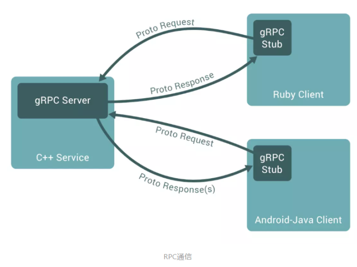
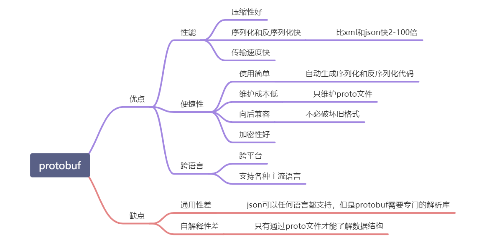
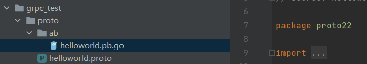

## 1、什么是grpc和protobuf

### grpc

gRPC 是一个高性能、开源和通用的 RPC 框架，面向移动和 HTTP/2 设计。目前提供 C、Java 和 Go 语言版本，分别是：[grpc](https://github.com/grpc/grpc), [grpc-java](https://github.com/grpc/grpc-java), [grpc-go](https://github.com/grpc/grpc-go). 其中 C 版本支持 [C](https://github.com/grpc/grpc), [C++](https://github.com/grpc/grpc/tree/master/src/cpp), [Node.js](https://github.com/grpc/grpc/tree/master/src/node), [Python](https://github.com/grpc/grpc/tree/master/src/python), [Ruby](https://github.com/grpc/grpc/tree/master/src/ruby), [Objective-C](https://github.com/grpc/grpc/tree/master/src/objective-c), [PHP](https://github.com/grpc/grpc/tree/master/src/php) 和 [C#](https://github.com/grpc/grpc/tree/master/src/csharp) 支持.



protobuf只是一个协议，基于这个协议可以自己开发一个rpc框架。grpc 也是使用的这个protobuf协议。

### protobuf

java中的dubbo 使用了 dubbo/rmi/hessian messagepack 等协议，如果你懂了协议完全有能力自己去实现一个协议

- 习惯用 `Json、XML` 数据存储格式的你们，相信大多都没听过`Protocol Buffer（缩写为protobuf）`
- `Protocol Buffer` 其实 是 `Google`出品的一种轻量 & 高效的结构化数据存储格式，性能比 `Json、XML` 真的强！太！多！

- protobuf经历了protobuf2和protobuf3，pb3比pb2简化了很多，目前主流的版本是pb3




如果是服务直接内部调用使用protobuf会比较好一些，如果是作为开发接口供客户端调用使用json会比较好，因为json没有加密，容易看懂。


### gRPC over HTTP/2

准确来说gRPC设计上是分层的，底层支持不同的协议，目前gRPC支持：

gRPC over HTTP2
gRPC Web
但是大多数情况下，讨论都是基于gRPC over HTTP2。

下面从一个真实的gRPC SayHello请求，查看它在HTTP/2上是怎样实现的。用wireshark抓包：


可以看到下面这些Header：

Header: :authority: localhost:50051
Header: :path: /helloworld.Greeter/SayHello
Header: :method: POST
Header: :scheme: http
Header: content-type: application/grpc
Header: user-agent: grpc-java-netty/1.11.0

然后请求的参数在DATA frame里：

GRPC Message: /helloworld.Greeter/SayHello, Request
简而言之，gGRPC把元数据放到HTTP/2 Headers里，请求参数序列化之后放到 DATA frame里。


## 2、grpc开发环境的搭建

### 1. 下载工具

https://github.com/protocolbuffers/protobuf/releases

如果觉得下载较慢可以点击这里下载：

[📎protoc-3.13.0-win64.zip](https://www.yuque.com/attachments/yuque/0/2020/zip/159615/1603012438943-0f20e6d0-f381-4dc7-a99d-2a77031a03b1.zip)

[📎protoc-3.13.0-linux-x86_64.zip](https://www.yuque.com/attachments/yuque/0/2020/zip/159615/1603012438961-8d1df617-b453-4934-8ebe-262e6c3df02d.zip)

下载完成后解压后记得将可执行文件protoc.exe 路径添加到环境变量中


### 2. 下载go的依赖包

```shell
go get github.com/golang/protobuf/protoc-gen-go
```


protoc是protobuf文件（.proto）的编译器，可以借助这个工具把 .proto 文件转译成各种编程语言对应的源码，包含数据类型定义、调用接口等。

protoc在设计上把protobuf和不同的语言解耦了，底层用c++来实现protobuf结构的存储，然后通过插件的形式来生成不同语言的源码。可以把protoc的编译过程分成简单的两个步骤：

1）解析.proto文件，转译成protobuf的原生数据结构在内存中保存；

2）把protobuf相关的数据结构传递给相应语言的编译插件，由插件负责根据接收到的protobuf原生结构渲染输出特定语言的模板。

源码中包含的插件有 csharp、java、js、objectivec、php、python、ruby等多种。

protoc-gen-go是protobuf**编译插件**系列中的Go版本。从上一小节知道原生的protoc并不包含Go版本的插件，不过可以在github上发现专门的代码库


由于protoc-gen-go是Go写的，所以安装它变得很简单，只需要运行 `go get -u github.com/golang/protobuf/protoc-gen-go`，便可以在$GOPATH/bin目录下发现这个工具。

```shell
protoc --go_out=output_directory input_directory/file.proto
```

其中"--go_out="表示生成Go文件，上述命令只会生成 传输数据 相关的 go语言的 结构体、序列化与反序列化相关代码，并不会生成接口方法相关的go 代码。


### 3. proto文件

```go
syntax = "proto3";
option go_package = ".;proto";
service Greeter {
  rpc SayHello (HelloRequest) returns (HelloReply);
}

message HelloRequest {
  string name = 1; //1是编号不是值
}

message HelloReply {
  string message = 1;
}
```

### 4. 生成go文件

```shell
protoc -I . goods.proto --go_out=plugins=grpc:.
```

### 5. 服务端代码

```go
package main

import (
    "context"
    "fmt"
    "google.golang.org/grpc"
    "grpc_demo/hello"
    "net"
)

type Server struct {
}


func (s *Server)  SayHello(ctx context.Context,request *hello.HelloRequest)(*hello.HelloReply,error){
    return &hello.HelloReply{Message:"Hello "+request.Name},nil
}

func main()  {
    g := grpc.NewServer()
    s := Server{}
    hello.RegisterGreeterServer(g,&s)
    lis, err := net.Listen("tcp", fmt.Sprintf(":8080"))
    if err != nil {
        panic("failed to listen: "+err.Error())
    }
    g.Serve(lis)
}
```

### 6. 客户端

```go
package main

import (
    "context"
    "fmt"
    "google.golang.org/grpc"
    "grpc_demo/proto"
)

func main()  {
    conn,err := grpc.Dial("127.0.0.1:8080",grpc.WithInsecure())
    if err!=nil{
        panic(err)
    }
    defer conn.Close()
    c := hello.NewGreeterClient(conn)
    r,err := c.SayHello(context.Background(),&hello.HelloRequest{Name:"bobby"})
    if err!=nil{
        panic(err)
    }
    fmt.Println(r.Message)
}
```


## 3、protobuf和json的直观对比

编写proto文件 helloworld.proto

```protobuf
syntax = "proto3";
option go_package = "./;proto";  //新版本中需要加 /
message HelloRequest{
  string name = 1; //1是编号不是值
  int32 age = 2;
  repeated string courses = 3; //repeated 表示是一个切片，可以重复的值。
}
```

在控制台 cd 到 helloworld.proto 文件目录，运行下面命令 

```shell
protoc -I . helloworld.proto --go_out=plugins=grpc:. 
```

来生成go文件。

实际使用过程中，改用了 protoc --go_out=.  ./helloworld.proto 也可以生成成功，也就是使用了命令

```shell
#该命令无法生成 接口方法相关的go语言 grpc 代码
protoc --go_out=output_directory input_directory/file.proto
```

新建proto编码测试文件，会发现protobuf协议打印出来的字符很少，比json占用的空间少，提高了传输效率。

```go
package main

import (
	hello "OldPackageTest/helloworld/proto"
	"encoding/json"
	"fmt"
)
import "github.com/golang/protobuf/proto"

type Hello struct {
	Name    string   `json:"name"`
	Age     int      `json:"age"`
	Courses []string `json:"courses"`
}

func main() {
	req := hello.HelloRequest{
		Name:    "Tom",
		Age:     18,
		Courses: []string{"go", "gin", "微服务"},
	}
	rsp, _ := proto.Marshal(&req)
	fmt.Println(string(rsp))

	jsonStruct := Hello{Name: "Tom", Age: 18, Courses: []string{"go", "gin", "微服务"}}
	jsonRsp, _ := json.Marshal(jsonStruct)
	fmt.Println(string(jsonRsp))
}
```

反序列化测试

```go
package main

import (
	hello "OldPackageTest/helloworld/proto"
	"fmt"
)
import "github.com/golang/protobuf/proto"

type Hello struct {
	Name    string   `json:"name"`
	Age     int      `json:"age"`
	Courses []string `json:"courses"`
}

func main() {
	req := hello.HelloRequest{
		Name:    "Tom",
		Age:     18,
		Courses: []string{"go", "gin", "微服务"},
	}
	rsp, _ := proto.Marshal(&req)
	fmt.Println(string(rsp))

	newReq := hello.HelloRequest{}
	_ = proto.Unmarshal(rsp, &newReq)
	fmt.Println(newReq.Name, newReq.Age, newReq.Courses)
}

```

## 4、为什么需要安装protoc和protoc-gen-go？

```protobuf
syntax = "proto3";
option go_package = "./;proto";  //新版本中需要加 /


service Hello {
  rpc Hello(HelloRequest) returns (Response); //Hello 接口
}

message HelloRequest{
  string name = 1; //1是编号不是值
  int32 age = 2;
  repeated string courses = 3; //repeated 表示是一个切片，可以重复的值。
}

message Response{
  string reply = 1;
}
```

上面的 Hello 并不属于序列化的一部分，但是为什么 通过命令生成了rpc的客户端、服务端代码呢？

原因是 protoc 留有了一种插件机制，可以允许自己编写插件，在原来protoc解析的基础上，进一步增强解析功能，由插件实现。

上面的 Hello 接口 的解析就是通过 protoc-gen-go 这个插件实现的。

很多的框架为了自己的个性化需求，都会自己写插件来对proto文件进行解析。

```shell
protoc -I . helloworld.proto --go_out=plugins=grpc:.
-I 表示 input , `.`表示当前目录
--go_out 表示生成 go 语言的代码
plugins=grpc 表示 调用 protoc-gen-go 插件生成 接口相关的Go代码
：. 表示在当前目录生成代码，`:` 猜测可能是一个参数的分隔符
#使用下面的命令，只会生成 传输的数据 相关的 结构体、序列化、反序列功能 代码，并不包含 grpc 接口部分的代码。 
protoc -I . helloworld.proto --go_out=:.

#该命令也同样无法生成 接口方法相关的go语言 grpc 代码
protoc --go_out=output_directory input_directory/file.proto
```

## 5、go下grpc快速体验

### go_package 说明

```go
syntax = "proto3";
option go_package = "./ab;proto22";
```

- go_package: 标明只会影响go语言，对其他语言无效
- `./ab`：表示生成的文件的存放目录位于 proto文件当前目录下的 ab 目录下面，
- `;`: 分隔符
- `proto22`: 表示自定义生成的go代码的包名。



### proto

```protobuf
syntax = "proto3";
option go_package = "./;proto";  //新版本中需要加 `/`


service Greeter {
  rpc SayHello(HelloRequest) returns (HelloReply); //Hello 接口
}

message HelloRequest{
  string name = 1; //1是编号不是值
}

message HelloReply{
  string message = 1;
}

//go语言会生成一个文件，python 会生成两个文件。
```

### server

```go
package main

import (
	"OldPackageTest/grpc_test/proto"
	"context"
	"google.golang.org/grpc"
	"net"
)

type Server struct {
}

// SayHello 第一个参数一定要是context,ctx 主要解决协程超时
func (s *Server) SayHello(ctx context.Context, request *proto.HelloRequest) (*proto.HelloReply, error) {

	return &proto.HelloReply{Message: "hello," + request.Name}, nil
}

func main() {
	g := grpc.NewServer()
	proto.RegisterGreeterServer(g, &Server{})
	lis, err := net.Listen("tcp", "0.0.0.0:8088")
	if err != nil {
		panic("failed to listen:" + err.Error())
	}
	err = g.Serve(lis)
	if err != nil {
		panic("failed to start grpc:" + err.Error())
	}
}
```


### client

```go
package main

import (
	"OldPackageTest/grpc_test/proto"
	"context"
	"fmt"
	"google.golang.org/grpc"
)

func main() {
	conn, err := grpc.Dial("127.0.0.1:8088", grpc.WithInsecure())
	if err != nil {
		panic(err)
	}
	defer conn.Close()

	c := proto.NewGreeterClient(conn)
	r, err := c.SayHello(context.Background(), &proto.HelloRequest{Name: "Francisco"})
	if err != nil {
		panic(err)
	}
	fmt.Println(r.Message)
}
```

## 6、grpc的流模式的定义

### **grpc的四种数据流**

之前我们讲了 grpc 怎么简单的使用 ，这次讲讲 grpc 中的 stream，srteam 顾名思义 就是 一种 流，可以源源不断的 推送 数据，很适合 传输一些大数据，或者 服务端 和 客户端 长时间 数据交互，比如 客户端 可以向 服务端 订阅 一个数据，服务端 就 可以利用 stream ，源源不断地 推送数据。

1. 简单模式（Simple RPC）
2. 服务端数据流模式（Server-side streaming RPC）
3. 客户端数据流模式（Client-side streaming RPC）
4. 双向数据流模式（Bidirectional streaming RPC）

### 简单模式

这种模式最为传统，即客户端发起一次请求，服务端响应一个数据，这和大家平时熟悉的RPC以及前面章节使用的RPC没有什么大的区别，所以不再详细介绍。

### 服务端数据流模式

这种模式是客户端发起一次请求，服务端返回一段连续的数据流。典型的例子是客户端向服务端发送一个股票代码，服务端就把该股票的实时数据源源不断的返回给客户端。

### 客户端数据流模式

与服务端数据流模式相反，这次是客户端源源不断的向服务端发送数据流，而在发送结束后，由服务端返回一个响应。典型的例子是物联网终端向服务器报送数据。

### 双向数据流模式

顾名思义，这是客户端和服务端都可以向对方发送数据流，这个时候双方的数据可以同时互相发送，也就是可以实现实时交互。典型的例子是聊天机器人。


### proto

```go
syntax = "proto3";
option go_package = "./;proto";

service Greeter {
  rpc GetStream(StreamReqData) returns (stream StreamResData); //服务端流模式，返回参数加关键字 stream
  rpc PutStream(stream StreamReqData) returns (StreamResData); //客户端流模式，请求参数加关键字 stream
  rpc AllStream(stream StreamReqData) returns (stream StreamResData); //双向流模式
}

message StreamReqData {
  string  data = 1;
}

message StreamResData {
  string  data = 1;
}
```


### server

```go
package main

const PORT = ":50052"

type server struct {
}

func (s *server) GetStream(req *proto.StreamReqData, res proto.Greeter_GetStreamServer) error {
	i := 0
	for {
		i++
		_ = res.Send(&proto.StreamResData{
			Data: fmt.Sprintf("%v", time.Now().Unix()),
		})
		time.Sleep(time.Second)
		if i > 10 {
			break
		}
	}
	return nil
}
func (s *server) PutStream(cliStr proto.Greeter_PutStreamServer) error {
	for {
		if tem, err := cliStr.Recv(); err == nil {
			log.Println(tem)
		} else {
			log.Println("break, err :", err)
			break
		}
	}
	return nil
}
func (s *server) AllStream(allStr proto.Greeter_AllStreamServer) error {
	wg := sync.WaitGroup{}
	wg.Add(2)
	go func() {
		for {
			data, _ := allStr.Recv()
			log.Println(data)
		}
		wg.Done()
	}()

	go func() {
		for {
			allStr.Send(&proto.StreamResData{Data: "ssss"})
			time.Sleep(time.Second)
		}
		wg.Done()
	}()

	wg.Wait()
	return nil
}

func main() {
	//监听端口
	lis, err := net.Listen("tcp", PORT)
	if err != nil {
		panic(err)
		return
	}
	//创建一个grpc 服务器
	s := grpc.NewServer()
	//注册事件
	proto.RegisterGreeterServer(s, &server{})
	//处理链接
	err = s.Serve(lis)
	if err != nil {
		panic(err)
	}

}
```


### client

```go
package main

func main() {
	//通过grpc 库 建立一个连接
	conn, err := grpc.Dial("localhost:50052", grpc.WithInsecure())
	if err != nil {
		return
	}
	defer conn.Close()
	//通过刚刚的连接 生成一个client对象。
	c := proto.NewGreeterClient(conn)
	//调用服务端推送流
	reqstreamData := &proto.StreamReqData{Data: "aaa"}
	res, _ := c.GetStream(context.Background(), reqstreamData)

	for {
		aa, err := res.Recv() //和socket编程的 recv send 是一致的
		if err != nil {
			log.Println(err)
			break
		}
		log.Println(aa)
	}

	//客户端 推送 流
	putRes, _ := c.PutStream(context.Background())
	i := 1
	for {
		i++
		putRes.Send(&proto.StreamReqData{Data: "ss"})
		time.Sleep(time.Second)
		if i > 10 {
			break
		}
	}

	//服务端 客户端 双向流
	allStr, _ := c.AllStream(context.Background())
	go func() {
		for {
			data, _ := allStr.Recv()
			log.Println(data)
		}
	}()

	go func() {
		for {
			allStr.Send(&proto.StreamReqData{Data: "ssss"})
			time.Sleep(time.Second)
		}
	}()

	select {}
}
```

