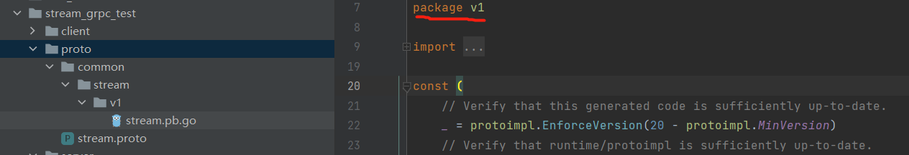

## 1、option go_package的作用

```protobuf
option go_package = "common/stream/v1";
```

最后面的v1，同时定义了路径和包名。当末尾路径和包名一致时使用这种写法更方便，可以不使用之前`;`的定义方法。



## 2、proto文件同步时的坑

服务端的proto文件和客户端的proto文件不一致，就有可能出现各种解析问题。message 内字段的编号，两边一定要一致。

## 3、proto文件中import另一个proto文件

### rpc方法没有参数，但是必须要有占位

```protobuf
syntax = "proto3";
option go_package = ".;proto";
service Greeter {
    rpc SayHello (HelloRequest) returns (HelloReply);
    rpc Ping(Empty) returns (Pong);
}

message HelloRequest {
    string url = 1;
    string name = 2;
}

message HelloReply {
    string message = 1;
}
message Empty{  //需要定义一个空的message
}
message Pong{
    string id = 1;
}
```

### 公用message提取

由于多个proto文件都需要Ping,但是同一个message在一个包下面只能有一个。所以需要放到一个单独的包内。然后在其他的proto文件内使用 import 来引入。

**base.proto**

```protobuf
syntax = "proto3";
option go_package = ".;proto";

message Empty{ 
}
message Pong{
    string id = 1;
}
```

**hello.proto**

```protobuf
syntax = "proto3";
import "base.proto";
option go_package = ".;proto";
service Greeter {
    rpc SayHello (HelloRequest) returns (HelloReply);
    rpc Ping(Empty) returns (Pong);
}

message HelloRequest {
    string url = 1;
    string name = 2;
}

message HelloReply {
    string message = 1;
}
```

### 内置Empty

```protobuf
syntax = "proto3";
import "base.proto";
import "google/protobuf/empty.proto";
option go_package = ".;proto";
service Greeter {
    rpc SayHello (HelloRequest) returns (HelloReply);
    rpc Ping(google.protobuf.Empty) returns (Pong);
}

message HelloRequest {
    string url = 1;
    string name = 2;
}

message HelloReply {
    string message = 1;
}

```

### 如何在go中使用import的proto定义的message

1、找到import的proto源码，找到对应的 go_package，通过 go_package 定义的路径来确定 生成go 代码中的包名。 


## 4、嵌套的message对象

```protobuf
message HelloReply {
    string message = 1;

    message Result {	//放到HelloReply里边是为了不想做成公用的，只在Reply内部使用。
        string name = 1;
        string url = 2;
    }

    repeated Result data = 2;
}

```

在go代码中实例化 Result : proto.HelloReply_Result{} ，Result 名字会被修改。


## 5、protobuf中的enum枚举类型

```protobuf
enum Gender{
    MALE = 0;
    FEMALE = 1;
}

message HelloRequest {
    string name = 1; 
    string url = 2;
    Gender g = 3;
}
```

```go
rsp, _ := client.SayHello(context.Background(), &proto_bak.HelloRequest{
		Name: "bobby",
		Url:  "https://imooc.com",
		G:    proto_bak.Gender_MALE,
	})
```

## 6、map 类型 和 timestamp类型

```protobuf

message HelloRequest {
    string name = 1; //姓名 相当于文档
    string url = 2;
    Gender g = 3;
    map<string, string> mp = 4; // 不容易写文档注释，所以不要太频繁使用。
    google.protobuf.Timestamp addTime = 5;
}
```

```go
rsp, _ := client.SayHello(context.Background(), &proto_bak.HelloRequest{
		Name: "bobby",
		Url:  "https://imooc.com",
		G:    proto_bak.Gender_MALE,
		Mp: map[string]string{
			"name":    "bobby",
			"company": "慕课网",
		},
		AddTime: timestamppb.New(time.Now()),
	})
```

## 7、grpc的metadata机制

### 简介

gRPC让我们可以向本地调用一样实现远程调用，对于每一次的rpc调用，都可能会有一些有用的数据，而这些数据就可以通过metadata来传递。metadata是以key-value的形式存储数据的，其中key是string类型，而value是[]string，即一个字符串切片类型。metadata使得client和server能够为对方提供关于本次调用的一些信息，就行一次http请求的RequestHeader和ResponseHeaader一样。http中header的声明周期是一次http请求，metadata的生命周期则是一次 RPC 调用。

在http请求中，我们可以把一些跟业务无关的数据 例如 token 放到 header 中去。

在grpc中，我们也可以用 metadata 存放远程调用权限相关的数据。

### 创建metadata

MD 类型实际上是map，key是string，value是string类型的slice。

```go
type MD map[string][]string
```


创建的时候可以像创建普通的map类型一样使用new关键字进行创建：

```go
md := metadata.New(map[string]string{"key1": "val1", "key2": "val2"})
```


或者使用Pairs创建，相同的key值会被组合成slice。

```go
md := metadata.Pairs(
    "key1", "val1",
    "key1", "val1-2", // "key1" will have map value []string{"val1", "val1-2"}
    "key2", "val2",
)
```

key不区分大小写，会被统一转成小写。

### 发送metadata

```go
md := metadata.Pairs("key", "val")

// 新建一个有 metadata 的 context
ctx := metadata.NewOutgoingContext(context.Background(), md)

// 单向 RPC
response, err := client.SomeRPC(ctx, someRequest)
```

### 接收metadata

利用函数 `FromIncomingContext`从context中获取metadata:

```go
func (s *server) SomeRPC(ctx context.Context, in *pb.SomeRequest) (*pb.SomeResponse, err) {
    md, ok := metadata.FromIncomingContext(ctx)
    // do something with metadata
}
```

### 代码举例

**client端编写**

```go
func main() {
	//stream
	conn, err := grpc.Dial("127.0.0.1:50051", grpc.WithInsecure())
	if err != nil {
		panic(err)
	}
	defer conn.Close()

	c := proto.NewGreeterClient(conn)

	//md := metadata.Pairs("timestamp", time.Now().Format(timestampFormat))
	md := metadata.New(map[string]string{
		"name":    "bobby",
		"pasword": "imooc",
	})
	ctx := metadata.NewOutgoingContext(context.Background(), md)
	r, err := c.SayHello(ctx, &proto.HelloRequest{Name: "bobby"})
	if err != nil {
		panic(err)
	}
	fmt.Println(r.Message)
}
```


**server端编写**

```go
func (s *Server) SayHello(ctx context.Context, request *proto.HelloRequest) (*proto.HelloReply,
	error) {

	md, ok := metadata.FromIncomingContext(ctx)
	if ok {
		fmt.Println("get metadata error")
	}
	if nameSlice, ok := md["name"]; ok {
		fmt.Println(nameSlice)
		for i, e := range nameSlice {
			fmt.Println(i, e)
		}
	}
	return &proto.HelloReply{
		Message: "hello " + request.Name,
	}, nil
}
```

## 8、 grpc拦截器

### server端编写

```go
func main() {
	interceptor := func(ctx context.Context, req interface{}, info *grpc.UnaryServerInfo, handler grpc.UnaryHandler) (resp interface{}, err error) {
		fmt.Println("接收到了一个新的请求")
		res, err := handler(ctx, req)
		fmt.Println("请求已经完成")
		return res, err
	}

	opt := grpc.UnaryInterceptor(interceptor)
	g := grpc.NewServer(opt)
	proto.RegisterGreeterServer(g, &Server{})
	lis, err := net.Listen("tcp", "0.0.0.0:50051")
	if err != nil {
		panic("failed to listen:" + err.Error())
	}
	err = g.Serve(lis)
	if err != nil {
		panic("failed to start grpc:" + err.Error())
	}
}
```

### client端编写

```go
func main() {
	//stream
	interceptor := func(ctx context.Context, method string, req, reply interface{}, cc *grpc.ClientConn, invoker grpc.UnaryInvoker, opts ...grpc.CallOption) error {
		start := time.Now()
		err := invoker(ctx, method, req, reply, cc, opts...)
		fmt.Printf("耗时：%s\n", time.Since(start))
		return err
	}
	var opts []grpc.DialOption
	opts = append(opts, grpc.WithInsecure())
	opts = append(opts, grpc.WithUnaryInterceptor(interceptor))
	conn, err := grpc.Dial("127.0.0.1:50051", opts...)
	if err != nil {
		panic(err)
	}
	defer conn.Close()

	c := proto.NewGreeterClient(conn)
	r, err := c.SayHello(context.Background(), &proto.HelloRequest{Name: "bobby"})
	if err != nil {
		panic(err)
	}
	fmt.Println(r.Message)
}

```

### 使用拦截器实现多种功能的第三方库

**go-grpc-middleware**


## 9、 通过拦截器和metadata实现grpc的auth认证

### client端编写

```go
func main() {
	interceptor := func(ctx context.Context, method string, req, reply interface{}, cc *grpc.ClientConn, 	invoker grpc.UnaryInvoker, opts ...grpc.CallOption) error{
		start := time.Now()
		md := metadata.New(map[string]string{
			"appid":"10101",
			"appkey":"i am key",
	})
		ctx = metadata.NewOutgoingContext(context.Background(), md)
		err := invoker(ctx, method, req, reply, cc, opts...)
		fmt.Printf("耗时：%s\n", time.Since(start))
		return err
	}
	var opts []grpc.DialOption
	opts = append(opts, grpc.WithInsecure())
	opts = append(opts, grpc.WithUnaryInterceptor(interceptor))
	conn, err := grpc.Dial("127.0.0.1:50051", opts...)
	if err != nil {
		panic(err)
	}
	defer conn.Close()

	c := proto.NewGreeterClient(conn)
	r, err := c.SayHello(context.Background(), &proto.HelloRequest{Name: "bobby"})
	if err != nil {
		panic(err)
	}
	fmt.Println(r.Message)
}
```

### server端编写

```go
func main() {
	interceptor := func(ctx context.Context, req interface{}, info *grpc.UnaryServerInfo, handler grpc.UnaryHandler) (resp interface{}, err error) {
		fmt.Println("接收到了一个新的请求")
		md, ok := metadata.FromIncomingContext(ctx)
		fmt.Println(md)
		if !ok {
			//已经开始接触到grpc的错误处理了
			return resp, status.Error(codes.Unauthenticated, "无token认证信息")
		}

		var (
			appid  string
			appkey string
		)

		if va1, ok := md["appid"]; ok {
			appid = va1[0]
		}

		if va1, ok := md["appkey"]; ok {
			appkey = va1[0]
		}

		if appid != "101010" || appkey != "i am key" {
			return resp, status.Error(codes.Unauthenticated, "无token认证信息")
		}

		res, err := handler(ctx, req)
		fmt.Println("请求已经完成")
		return res, err
	}

	opt := grpc.UnaryInterceptor(interceptor)
	g := grpc.NewServer(opt)
	proto.RegisterGreeterServer(g, &Server{})
	lis, err := net.Listen("tcp", "0.0.0.0:50051")
	if err != nil {
		panic("failed to listen:" + err.Error())
	}
	err = g.Serve(lis)
	if err != nil {
		panic("failed to start grpc:" + err.Error())
	}
}
```

### client端更简单写法

```go
func main() {
	grpc.WithPerRPCCredentials(customCredential{})
	var opts []grpc.DialOption
	opts = append(opts, grpc.WithInsecure())
	opts = append(opts, grpc.WithPerRPCCredentials(customCredential{}))
	conn, err := grpc.Dial("127.0.0.1:50051", opts...)
	if err != nil {
		panic(err)
	}
	defer conn.Close()

	c := proto.NewGreeterClient(conn)
	r, err := c.SayHello(context.Background(), &proto.HelloRequest{Name: "bobby"})
	if err != nil {
		panic(err)
	}
	fmt.Println(r.Message)
}
```

## 10、grpc的验证器

### 1. 安装和配置 

**linux**

```shell
# fetches this repo into $GOPATH
go get -d github.com/envoyproxy/protoc-gen-validate

# installs PGV into $GOPATH/bin
make build
```

**windows**

[exe下载地址](https://oss.sonatype.org/content/repositories/snapshots/io/envoyproxy/protoc-gen-validate/protoc-gen-validate/0.4.0-SNAPSHOT/)

可以点此下载：[📎protoc-gen-validate.zip](https://www.yuque.com/attachments/yuque/0/2020/zip/159615/1603012793423-dd9f2f13-5b25-485b-80c0-390954d3b699.zip)


将 zip文件中的exe文件拷贝到 go的根补录的bin目录下

生成go源码

```shell
protoc -I .  --go_out=plugins=grpc:. --validate_out="lang=go:." helloworld.proto
```


### 2. proto

1. 新建validate.proto文件内容从 https://github.com/envoyproxy/protoc-gen-validate/blob/master/validate/validate.proto 拷贝
2. 新建helloworl.proto文件

```protobuf
syntax = "proto3";

import "validate.proto";
option go_package=".;proto";

service Greeter {
    rpc SayHello (Person) returns (Person);
}

message Person {
    uint64 id    = 1 [(validate.rules).uint64.gt    = 999];

    string email = 2 [(validate.rules).string.email = true];
    string name  = 3 [(validate.rules).string = {
                      pattern:   "^[^[0-9]A-Za-z]+( [^[0-9]A-Za-z]+)*$",max_bytes: 256,}];

}
```

### 3. 服务端

```go
package main

import (
	"context"
	"google.golang.org/grpc/codes"
	"google.golang.org/grpc/status"
	"net"

	"google.golang.org/grpc"

	"start/pgv_test/proto"
)


type Server struct{}

func (s *Server) SayHello(ctx context.Context, request *proto.Person) (*proto.Person,
	error){
	return &proto.Person{
		Id: 32,
	}, nil
}

type Validator interface {
	Validate() error
}

func main(){
	var interceptor grpc.UnaryServerInterceptor
	interceptor = func(ctx context.Context, req interface{}, info *grpc.UnaryServerInfo, handler grpc.UnaryHandler) (resp interface{}, err error) {
		// 继续处理请求
		if r, ok := req.(Validator); ok {
			if err := r.Validate(); err != nil {
				return nil, status.Error(codes.InvalidArgument, err.Error())
			}
		}

		return handler(ctx, req)
	}
	var opts []grpc.ServerOption
	opts = append(opts, grpc.UnaryInterceptor(interceptor))

	g := grpc.NewServer(opts...)
	proto.RegisterGreeterServer(g, &Server{})
	lis, err := net.Listen("tcp", "0.0.0.0:50051")
	if err != nil{
		panic("failed to listen:"+err.Error())
	}
	err = g.Serve(lis)
	if err != nil{
		panic("failed to start grpc:"+err.Error())
	}
}
```

### 4. 客户端

```go
package  main

import (
	"context"
	"fmt"
	"google.golang.org/grpc"
	"start/pgv_test/proto"
)

type customCredential struct{}


func main() {
	var opts []grpc.DialOption

	//opts = append(opts, grpc.WithUnaryInterceptor(interceptor))
	opts = append(opts, grpc.WithInsecure())

	conn, err := grpc.Dial("localhost:50051", opts...)
	if err != nil {
		panic(err)
	}
	defer conn.Close()

	c := proto.NewGreeterClient(conn)
	//rsp, _ := c.Search(context.Background(), &empty.Empty{})
	rsp, err := c.SayHello(context.Background(), &proto.Person{
		Email: "bobby",
	})
	if err != nil {
		panic(err)
	}
	fmt.Println(rsp.Id)
}
```

## 11、 grpc的状态码

https://github.com/grpc/grpc/blob/master/doc/statuscodes.md

我们也可以自定义状态码，但是成本比较高


## 12、 grpc中的错误处理

###  服务端

```go
st := status.New(codes.InvalidArgument, "invalid username")
```

###  客户端

```go
st, ok := status.FromError(err)
if !ok {
    // Error was not a status error
}
st.Message()
st.Code()
```

## 13、grpc的超时机制

设置超时原因：

1. 网络抖动、网络拥塞
2. 服务器很慢
3. A->B->C->D ，设置超时，防止全链路阻塞。
4. 服务端设置超时不严谨，例如网络原因，即便服务端设置了超时，客户端还有可能超时。所以一般设置客户端超时。

客户端设置超时机制：

```go
ctx, _ := context.WithTimeout(context.Background(), time.Second*3)
	_, err = c.SayHello(ctx, &proto.HelloRequest{Name: "bobby"})
```

