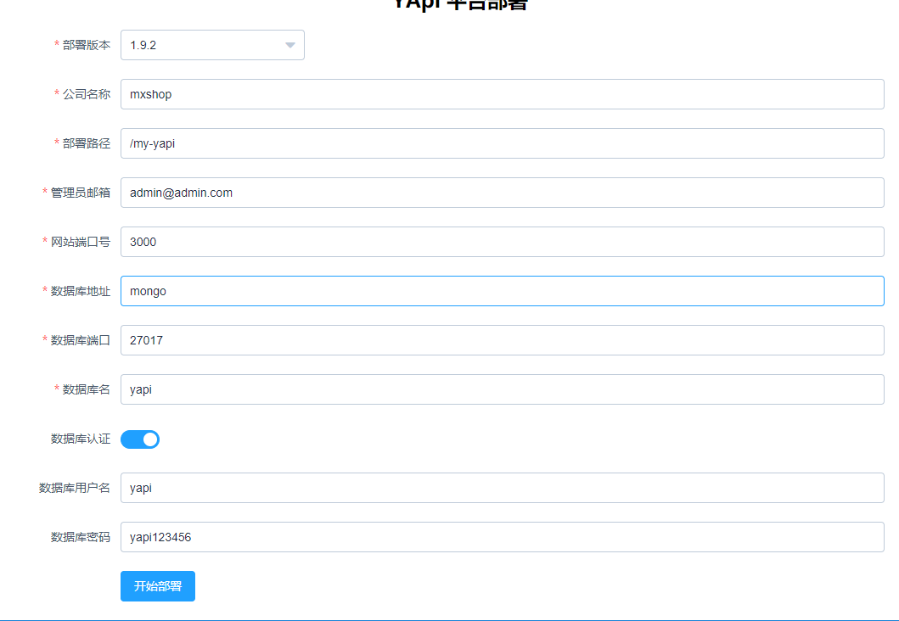

## 1、yapi的安装和配置

### 安装文档

[部署文档](https://github.com/Ryan-Miao/docker-yapi)

###  配置

访问 http://ip:9090, 然后严格按照下面填写（不要填写错了！）




点击“开始部署”

然后可以看到这些


拉到底部可以看到这些：


启动

1. 先进入之前的docker-api的目录下面的my-yapi目录


### 修改docker-compose.yml

部署完毕后, 修改docker-compose.yml 启用

```yaml
 yapi:
    build:
      context: ./
      dockerfile: Dockerfile
    image: yapi
    # 第一次启动使用
    # command: "yapi server"
    # 之后使用下面的命令
    command: "node /my-yapi/vendors/server/app.js"
```

### 启动服务

```shell
docker-compose up
```

### 访问

浏览器中输入 [http://192.168.1.103:3000](http://192.168.1.103:3000/login)

登录默认用户名和密码： 用户名是上面填写的管理员用户 admin@admin.com 默认密码是 ymfe.org