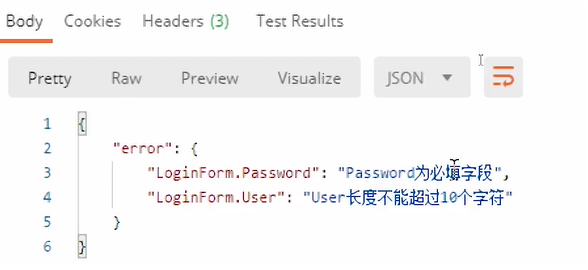
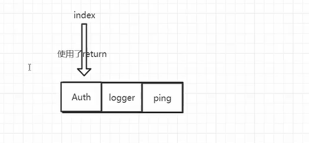
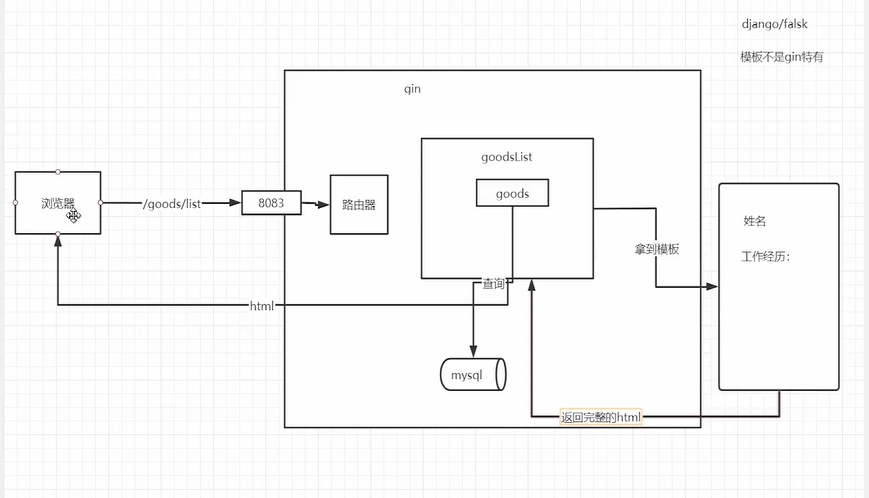

## 1、 gin的helloworld体验

### 官方文档地址

 https://gin-gonic.com/docs/quickstart/

Gin is a web framework written in Go (Golang),比较主流的go web 开发框架。

Beego是一个相对大而全的开发框架。

### 安装

go get -u github.com/gin-gonic/gin

go mod 模式下会自动根据import引用。

### 代码

```go
package main

import "github.com/gin-gonic/gin"

func main() {
	r := gin.Default()
	r.GET("/ping", func(c *gin.Context) {
		c.JSON(200, gin.H{
			"message": "pong",
		})
	})
    r.Run() // listen and serve on 0.0.0.0:8080，自定义端口（":8083"）
}
```

r.Get函数的第二个参数 就是一个   func(*Context) 的函数。上面和下面的这种写法是等效的。

```go

func pong(c *gin.Context) {
	c.JSON(200, gin.H{
		"message": "pong",
	})
}

func main() {
	r := gin.Default()
	r.GET("/ping", pong)
	r.Run() // listen and serve on 0.0.0.0:8080
}
```

```go
c.JSON(200, map[string]interface{}{   //也可以这样写，gin.H就是一个map类型的别名。用于缩短代码长度。
		"message": "pong",
	})
```

### 使用get、post、put等http方法

```go
package main

import "github.com/gin-gonic/gin"

func main() {
	// 使用默认中间件创建一个gin路由器
	// logger and recovery (crash-free) 中间件
	router := gin.Default()

	//restful 的开发中
	router.GET("/someGet", getting)
	router.POST("/somePost", posting)
	router.PUT("/somePut", putting)
	router.DELETE("/someDelete", deleting)
	router.PATCH("/somePatch", patching)
	router.HEAD("/someHead", head)
	router.OPTIONS("/someOptions", options)

	// 默认启动的是 8080端口，也可以自己定义启动端口
	router.Run()
	// router.Run(":3000") for a hard coded port
}
```


## 2、 使用New和Default初始化路由器的区别

new 和 default 都可以创建路由。

使用default 可以自动创建 logger and recovery (crash-free) 中间件，服务端收到请求后logger 会打印日志。

recovery 可以处理异常 panic，会自动返回错误状态码。

new 创建的路由在方法抛出异常后，没有返回响应。

## 3、 gin的路由分组

路由分组是为了区分不同的服务，由于相同的服务路由前缀相同，为了减少路径重复，使用路由。路由分组内的路径会自动再前面加上分组路径。

```go

func main() {
	router := gin.Default()
	goodsGroup := router.Group("/goods")
	{//大括号是为了增强可读性，表示代码块，没有逻辑意义，也可以去掉。
		goodsGroup.GET("", goodsList)
		goodsGroup.GET("/:id/:action/add", goodsDetail) //获取商品id为1的详细信息 模式
		goodsGroup.POST("", createGoods)
	}

	router.Run(":8083")
}
```

## 4、 获取url中的变量

```go
package main

import (
	"github.com/gin-gonic/gin"
	"net/http"
)

func main() {
	r := gin.Default()
	r.GET("/ping", func(c *gin.Context) {
		c.JSON(200, gin.H{
			"message": "pong",
		})
	})
	r.GET("/user/:name/:action/", func(c *gin.Context) {
		name := c.Param("name")
		action := c.Param("action")
		c.String(http.StatusOK, "%s is %s", name, action)
	})
    
    // *号这种模式要慎用，平时业务场景很少用到
    //action 会取到name后面的全部路径作为参数
    //例如 user/tom/delete/a/b   ,action 的值为路径 /tom/delete/a/b，最开始有个`/`
    //一般操作文件路径有可能用到，会匹配到很多路径。后面不固定
    r.GET("/user/:name/*action", func(c *gin.Context) {
		name := c.Param("name")
		action := c.Param("action")
		c.String(http.StatusOK, "%s is %s", name, action)
	})


	r.Run(":8082") 
}
```

约束路径参数的类型,比如 id 只能是int 类型。

```go
package main

import (
	"github.com/gin-gonic/gin"
	"net/http"
)

type Person struct {
	ID   int    `uri:"id" binding:"required"`
	Name string `uri:"name" binding:"required"`
}

func main() {
	router := gin.Default()
	router.GET("/:name/:id", func(c *gin.Context) {
		var person Person
		if err := c.ShouldBindUri(&person); err != nil {
			c.Status(404)
			return
		}
		c.JSON(http.StatusOK, gin.H{
			"name": person.Name,
			"id":   person.ID,
		})
	})
	router.Run(":8083")
}
```

## 5、 获取get和post表单信息

### 获取Get参数

```go
func main() {
	router := gin.Default()

	// 匹配的url格式:  /welcome?firstname=Jane&lastname=Doe
	router.GET("/welcome", func(c *gin.Context) {
		firstname := c.DefaultQuery("firstname", "Guest")  //默认值 Guest
		lastname := c.Query("lastname") // 是 c.Request.URL.Query().Get("lastname") 的简写

		c.String(http.StatusOK, "Hello %s %s", firstname, lastname)
	})
	router.Run(":8080")
}
```

### 获取post参数

```go
func main() {
	router := gin.Default()

	router.POST("/form_post", func(c *gin.Context) {
		message := c.PostForm("message")
		nick := c.DefaultPostForm("nick", "anonymous") // 此方法可以设置默认值

		c.JSON(200, gin.H{
			"status":  "posted",
			"message": message,
			"nick":    nick,
		})
	})
	router.Run(":8080")
}
```


### get、post混合

```go
POST /post?id=1234&page=1 HTTP/1.1
Content-Type: application/x-www-form-urlencoded

name=manu&message=this_is_great
func main() {
	router := gin.Default()

	router.POST("/post", func(c *gin.Context) {

		id := c.Query("id")
		page := c.DefaultQuery("page", "0")
		name := c.PostForm("name")
		message := c.PostForm("message")

		fmt.Printf("id: %s; page: %s; name: %s; message: %s", id, page, name, message)
	})
	router.Run(":8080")
}
```


## 6、 gin返回protobuf

### Json、protobuf 渲染

```go
package main

import (
	"net/http"

	"github.com/gin-gonic/gin"

	"OldPackageTest/gin_start/ch06/proto"
)

func main() {
	router := gin.Default()

	router.GET("/moreJSON", moreJSON)
	router.GET("/someProtoBuf", returnProto)

	router.Run(":8083")
}

func returnProto(c *gin.Context) {
	course := []string{"python", "go", "微服务"}
	user := &proto.Teacher{
		Name:   "bobby",
		Course: course,
	}
	c.ProtoBuf(http.StatusOK, user)
}

func moreJSON(c *gin.Context) {
	var msg struct {
		Name    string `json:"user"`
		Message string
		Number  int
	}
	msg.Name = "bobby"
	msg.Message = "这是一个测试json"
	msg.Number = 20

	c.JSON(http.StatusOK, msg)
}
```

### PureJSON

通常情况下，JSON 会将特殊的HTML 字符替换为对应的 unicode 字符，比如 < 替换为 \u003c，如果想原样输出 html，则使用 PureJSON。

```go
c.PureJSON(http.StatusOK, gin.H{
		"html": "<b>Hello,world!</b>",
	})
```


## 7、 登录的表单验证

若要将请求主体绑定到结构体中，请使用模型绑定。将请求参数绑定到制定类型，gin 目前支持json、xml与标准格式值(foo=bar&boo=baz)的绑定。

使用 [go-playground/validator.v8](https://github.com/go-playground/validator) 包作为验证器。 

validator 是第三方的独立库，有单独的github项目。https://github.com/go-playground/validator

注意，你需要在你想绑定的所有字段上设置相应的标签(tag)，比如说，绑定到json，则需要设置标签：`json:"fieldname"`。

gin 提供了两种绑定方法：

- ***Must bind\***
- - ***Methods\*** - Bind, BindJSON, BindQuery
- - ***Behavior\*** - These methods use MustBindWith under the hood。如果绑定错误，请求将被 c.AbortWithError(400, err).SetType(ErrorTypeBind) 中止，**响应状态码将被设置成400**，响应头 Content-Type 将被设置成 text/plain;charset=utf-8。如果你尝试在这之后设置相应状态码，将产生一个头已被设置的警告。如果想更灵活点，则需要使用 ShouldBind 类型的方法。
- ***Should bind\***
- - ***Methods\*** - ShouldBind, ShouldBindJSON, ShouldBindQuery
- - ***Behavior\*** - These methods use **ShouldBindWith** under the hood。如果出现绑定错误，这个错误将被返回，**并且开发人员可以进行适当的请求和错误处理**。

当使用绑定方法的时候，Gin tries to infer the binder depending on the Content-Type header。如果你确定你要绑定什么，你可以使用 MustBindWith 或 ShouldBindWith。

你也可以指定必须的字段，使用 `binding:"required"`，如果绑定的字段为空的话将返回一个错误。

大部分使用的都是 Should bind 。Must bind 底层也是调用的 Should bind。

gin 会根据请求header的类型来决定是调用 ShouldBind,ShouldBindJSON,ShouldBindQuery还是ShouldBindXML等方法验证。

```go
type Login struct {
   //实际使用过程中，只会对接一种接口，不同类型的接口参数名可以不同，互不影响。
    User     string `form:"user1" json:"user2" xml:"user3" binding:"required"`
    Password string `form:"password" json:"password" binding:"required"`
}
```


代码示例：

```go
type LoginForm struct {
	User     string `json:"user" binding:"required,min=3,max=10"`
	Password string `json:"password" binding:"required"`
}

func main() {
	router := gin.Default()
	router.POST("/loginJSON", func(c *gin.Context) {

		var loginForm LoginForm
		if err := c.ShouldBind(&loginForm); err != nil {
			c.JSON(http.StatusBadRequest, gin.H{
                "error": err.Error(),
			})
            return  //不加return会一次返回两个 json，C.json()方法是追究响应数据，不是覆盖。
		}

		c.JSON(http.StatusOK, gin.H{
			"msg": "登录成功",
		})
	})

	_ = router.Run(":8083")
}
```

## 8、 注册表单的验证

```go
type SignUpForm struct {
	Age        uint8  `json:"age" binding:"gte=1,lte=130"`
	Name       string `json:"name" binding:"required,min=3"`
	Email      string `json:"email" binding:"required,email"`
	Password   string `json:"password" binding:"required"`
	RePassword string `json:"re_password" binding:"required,eqfield=Password"` //跨字段验证,判断两次密码是否一致
}

func main() {
	router := gin.Default()
	router.POST("/signup", func(c *gin.Context) {
		var signUpFrom SignUpForm
		if err := c.ShouldBind(&signUpFrom); err != nil {
			fmt.Println(err.Error())
			c.JSON(http.StatusBadRequest, gin.H{
				"error": err.Error(),
			})
			return
		}

		c.JSON(http.StatusOK, gin.H{
			"msg": "注册成功",
		})
	})

	_ = router.Run(":8083")
}
```

文档地址：https://pkg.go.dev/github.com/go-playground/validator/v10#hdr-Cross_Field_Validation

除了 eqfield ，其他跨字段 tag 还有， Cross-Field Validation can be done via the following tags:

```
- eqfield
- nefield
- gtfield
- gtefield
- ltfield
- ltefield
- eqcsfield
- necsfield
- gtcsfield
- gtecsfield
- ltcsfield
- ltecsfield
```


## 9、 表单验证错误翻译成中文

**Usage and documentation**

Please see https://pkg.go.dev/github.com/go-playground/validator/v10 for detailed usage docs.

**Examples:**

- [Simple](https://github.com/go-playground/validator/blob/master/_examples/simple/main.go)
- [Custom Field Types](https://github.com/go-playground/validator/blob/master/_examples/custom/main.go)
- [Struct Level](https://github.com/go-playground/validator/blob/master/_examples/struct-level/main.go)
- [Translations & Custom Errors](https://github.com/go-playground/validator/blob/master/_examples/translations/main.go)
- [Gin upgrade and/or override validator](https://github.com/go-playground/validator/tree/v9/_examples/gin-upgrading-overriding)
- [wash - an example application putting it all together](https://github.com/bluesuncorp/wash)

validator 支持国际化的，查看官方文档的  Translations & Custom Errors 部分。

```go
import (
	"fmt"
	"net/http"
	"reflect"
	"strings"

	"github.com/gin-gonic/gin"
	"github.com/gin-gonic/gin/binding"
	"github.com/go-playground/locales/en"
	"github.com/go-playground/locales/zh"
	ut "github.com/go-playground/universal-translator"
	"github.com/go-playground/validator/v10"
	en_translations "github.com/go-playground/validator/v10/translations/en"
	zh_translations "github.com/go-playground/validator/v10/translations/zh"
)

var trans ut.Translator  //定义成全局，返回结果翻译的时候需要使用。

type SignUpForm struct {
	Age        uint8  `json:"age" binding:"gte=1,lte=130"`
	Name       string `json:"name" binding:"required,min=3"`
	Email      string `json:"email" binding:"required,email"`
	Password   string `json:"password" binding:"required"`
	RePassword string `json:"re_password" binding:"required,eqfield=Password"` //跨字段
}

func InitTrans(locale string) (err error) {
	//类型转换，修改gin框架中的validator引擎属性, 实现定制。
	if v, ok := binding.Validator.Engine().(*validator.Validate); ok {
		zhT := zh.New() //中文翻译器
		enT := en.New() //英文翻译器
		//第一个参数是备用的语言环境，后面的参数是应该支持的语言环境
		uni := ut.New(enT, zhT, enT)
		trans, ok = uni.GetTranslator(locale)
		if !ok {
			return fmt.Errorf("uni.GetTranslator(%s)", locale)
		}

		switch locale {
		case "en":
			en_translations.RegisterDefaultTranslations(v, trans)
		case "zh":
			zh_translations.RegisterDefaultTranslations(v, trans)
		default:
			en_translations.RegisterDefaultTranslations(v, trans)
		}
		return
	}

	return
}

func main() {
	//代码侵入性很强 中间件
	if err := InitTrans("zh"); err != nil {
		fmt.Println("初始化翻译器错误")
		return
	}
	router := gin.Default()
	router.POST("/loginJSON", func(c *gin.Context) {
		var loginForm LoginForm
		if err := c.ShouldBind(&loginForm); err != nil {
			errs, ok := err.(validator.ValidationErrors)
			if !ok {
				c.JSON(http.StatusOK, gin.H{
					"msg": err.Error(),
				})
			}
			c.JSON(http.StatusBadRequest, gin.H{
				"error": errs.Translate(trans),  //负责错误信息翻译
			})
			return
		}

		c.JSON(http.StatusOK, gin.H{
			"msg": "登录成功",
		})
	})

	_ = router.Run(":8083")
}
```

返回结果：




## 10、 表单中文翻译的json格式化细节

### 解决字段命名不是tag的问题

注册一个函数来解决。`json:"-"`  如果是”-“表示不处理，这个是json tag 的一种约束。

```go
func InitTrans(locale string) (err error) {
	//类型转换，修改gin框架中的validator引擎属性, 实现定制。
	if v, ok := binding.Validator.Engine().(*validator.Validate); ok {
		//注册一个获取json的tag的自定义方法
		v.RegisterTagNameFunc(func(fld reflect.StructField) string {
			name := strings.SplitN(fld.Tag.Get("json"), ",", 2)[0]
			if name == "-" { 
				return ""
			}
			return name
		})

		zhT := zh.New() //中文翻译器
		enT := en.New() //英文翻译器
		//第一个参数是备用的语言环境，后面的参数是应该支持的语言环境
		uni := ut.New(enT, zhT, enT)
		trans, ok = uni.GetTranslator(locale)
		if !ok {
			return fmt.Errorf("uni.GetTranslator(%s)", locale)
		}

		switch locale {
		case "en":
			en_translations.RegisterDefaultTranslations(v, trans)
		case "zh":
			zh_translations.RegisterDefaultTranslations(v, trans)
		default:
			en_translations.RegisterDefaultTranslations(v, trans)
		}
		return
	}

	return
}
```

SplitN 以 sep 为分隔符，将 s 切分成多个子串，结果中不包含 sep 本身
如果 sep 为空，则将 s 切分成 Unicode 字符列表。
 如果 s 中没有 sep 子串，则将整个 s 作为 []string 的第一个元素返回
 参数 n 表示最多切分出几个子串，超出的部分将不再切分。
 如果 n 为 0，则返回 nil，如果 n 小于 0，则不限制切分个数，全部切分

```go
func SplitN(s, sep string, n int) []string
```

加上了上边的注册函数后，返回结果 都变成了小写的 password, user 。

### 去掉LoginForm

```go
func removeTopStruct(fileds map[string]string) map[string]string {
	rsp := map[string]string{}
	for field, err := range fileds {
		//字符串和切片底层数据结构是一样的，可以当作切片处理。
		rsp[field[strings.Index(field, ".")+1:]] = err // 找到 . 的位置，然后提取子串
	}
	return rsp
}

c.JSON(http.StatusBadRequest, gin.H{
				"error": removeTopStruct(errs.Translate(trans)),
			})
```


## 11、 自定义gin中间件

想要打印方法执行时长，代码侵入性很强 使用中间件解决。

```go
func main() {
	router := gin.New()  //先生成不带中间件的router
	//使用logger中间件
	router.Use(gin.Logger())
	//使用recovery中间件
	router.Use(gin.Recovery())
}
//上面这种写法 等效于 router := gin.Default()
```

```go
func main() {
	router := gin.New()  
	//也可以写到一起，使用logger和recovery中间件 全局所有，所有的url都使用这个中间件
	router.Use(gin.Logger(),gin.Recovery())
}
```

为了避免全局注册中间件，如果只针对某一组url使用中间件，使用下面这种写法。这样就只有 /goods 才会起作用。

我们也可以只针对某一个特定的url注册中间件。

```go
authrized := router.Group("/goods")
authrized.Use(AuthRequired)

func AuthRequired(context *gin.Context) {

}
```


**代码案例**

```go
func MyLogger() gin.HandlerFunc {
	return func(c *gin.Context) {
		t := time.Now()
		c.Set("example", "123456")
		//让原本改执行的逻辑继续执行
		c.Next()

		end := time.Since(t)
		fmt.Printf("耗时:%V\n", end)
		status := c.Writer.Status()
		fmt.Println("状态", status)
	}
}

func main() {
	router := gin.Default()
	//使用logger和recovery中间件 全局所有
	router.Use(MyLogger())

	router.GET("/ping", func(c *gin.Context) {
		c.JSON(http.StatusOK, gin.H{
			"message": "pong",
		})
	})

	router.Run(":8083")
}
```

## 12、 通过abort终止中间件后续逻辑的执行

如果我们想在中间件函数内提前终止，不再继续向下执行，必须使用 c.Abort()，使用return 不起作用， return 后然后 会执行 ping 处理函数。

```go
func TokenRequired() gin.HandlerFunc {
	return func(c *gin.Context) {
		var token string
		for k, v := range c.Request.Header {
			if k == "X-Token" {
				token = v[0]
			}
		}
		if token != "bobby" {
			c.JSON(http.StatusUnauthorized, gin.H{
				"msg": "未登录",
			})
            // 挑战，我们会有一个疑问，为什么 return 都阻止不了后续逻辑的执行。
            //此处使用 return 仍然能正常返回接口响应。响应结果有两个json，一个是未登录，一个是 pong
			c.Abort() 
		}
		c.Next()
	}
}
```

## 13、 gin的中间件原理源码分析


## 

中间件以及接口处理方法是放到一个切片里边的。

当在一个方法中执行next()时，index会++，然后执行下一个方法。

当方法通过return 结束时，如果 index 没有在切片的末尾，则gin 会接着继续执行 切片的函数。

想要提前终止，就需要通过 abort()方法，强行改变 index 的值，将index设置成最大值。gin就不会继续执行队列内的函数。


## 14、 gin返回html

gin 没有自己实现一个 html 模板语法，而是使用了 go 标准库中的 模板

官方地址：https://golang.org/pkg/html/template/

翻译： https://colobu.com/2019/11/05/Golang-Templates-Cheatsheet/#if/else_%E8%AF%AD%E5%8F%A5

gin 一般用来通过 restfull接口实现微服务的调用，返回html 的情况比较少。所以不是重点。


**模板在web系统中的地位：**




模板文件可以是 .tmpl 也可以是 html，没有大的区别。

```go
//这种是相对路径，没法直接在IDE里边运行，会因为路径错误而程序报错
//在控制台build，然后运行可执行文件，路径正确，程序正常运行。
router.LoadHTMLFiles("templates/index.tmpl", "templates/goods.html")
```

为什么我们在Goland里边直接运行程序，没有看到生成 .exe 可执行文件。是因为IDE把可执行文件生成在了临时目录。

```go
//为什么我们通过goland运行main.go的时候并没有生成main.exe文件
dir, _ := filepath.Abs(filepath.Dir(os.Args[0]))
fmt.Println(dir)
//C:\Users\Francisco\AppData\Local\Temp\GoLand\___1go_build_OldPackageTest_gin_start_ch09.exe
```

代码示例： 需要在templates目录下新建 index.tmpl 文件。

```go
package main

import (
	"fmt"
	"github.com/gin-gonic/gin"
	"net/http"
	"os"
	"path/filepath"
)

func main() {
	router := gin.Default()
	//LoadHTMLFiles会将指定的目录下的文件加载好， 相对目录
	//为什么我们通过goland运行main.go的时候并没有生成main.exe文件
	dir, _ := filepath.Abs(filepath.Dir(os.Args[0]))
	fmt.Println(dir)
	
	router.LoadHTMLFiles("templates/index.tmpl")
    
	router.GET("/index", func(c *gin.Context) {
		c.HTML(http.StatusOK, "index.tmpl", gin.H{
			"title": "慕课网",
		})
	})

	router.Run(":8083")
}
```


## 15、 加载多个html文件

### 方法一

```go
router.LoadHTMLFiles("templates/index.tmpl", "templates/goods.html")
```

### 方法二

如果文件过多的话，采用下面这种模式

```go
//会加载 templates 二级目录下面所有文件，templates/* 在有二级目录的情况下会报错
//采用这种模板路径，一级目录下的文件无法被加载，所有 index.tmpl 需要被放到 default 目录下面。
router.LoadHTMLGlob("templates/**/*")
```

### 模板文件名同名问题解决

```go
// 先使用 define 重命名模板名
{{define "goods/list.html"}}
<!DOCTYPE html>
<html lang="en">
<link rel="stylesheet" href="/static/css/style.css">
<head>
    <meta charset="UTF-8">
    <title>Title</title>
</head>
<body>
    <h1>商品列表页</h1>
</body>
</html>
{{end}}


//html 或者 tmpl 文件都可以作为模板文件
//如果没有在模板中使用define定义 那么我们就可以使用默认的文件名来找，并且不能加路径区分，这样文件同名的情况下会出现问题。
router.GET("/goods/list", func(c *gin.Context) {
    c.HTML(http.StatusOK, "goods/list.html", gin.H{
        "title": "慕课网",
    })
})
```

## 16、 static静态文件的处理

```go
//第一个/static 是url /static 路径， 第二个参数 代表目录。
router.Static("/static", "./static")

//html 引用
<link rel="stylesheet" href="/static/css/style.css">
```

## 17、 gin的优雅退出

需要在控制台运行，然后使用 ctl+c ，信号才会起作用。

```go
package main

import (
	"fmt"
	"github.com/gin-gonic/gin"
	"net/http"
	"os"
	"os/signal"
	"syscall"
)

func main() {
	//优雅退出 就是当我们关闭程序的时候，保证程序应该做完一些后续处理再退出，而不是突然终止造成数据丢失。
	//微服务 启动之前或启动之后都会做一件事：将当前服务的ip地址和端口号注册到注册中心
	//没有优雅退出，导致程序停止了之后没有告知注册中心。
	router := gin.Default()

	router.GET("/ping", func(c *gin.Context) {
		c.JSON(http.StatusOK, gin.H{
			"message": "pong",
		})
	})

	go func() {
		router.Run(":8083")
	}()

	//如果想要接收到信号
	quit := make(chan os.Signal)
	signal.Notify(quit, syscall.SIGINT, syscall.SIGTERM) //ctl+c 和 kill 信号

	<-quit
	//处理后续逻辑，完成优雅退出
	fmt.Println("关闭服务中.....")
	fmt.Println("注销服务.....")
}

```

