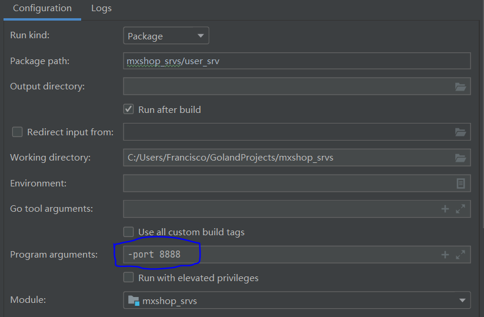

## 1、 定义用户表结构

定义自己的model是为了方便添加自己的公用字段。

```go
package model

import (
	"time"

	"gorm.io/gorm"
)

// BaseModel 定义自己的model是为了方便添加自己的公用字段
type BaseModel struct {
	ID        int32     `gorm:"primarykey"`
	CreatedAt time.Time `gorm:"column:add_time"`
	UpdatedAt time.Time `gorm:"column:update_time"`
	DeletedAt gorm.DeletedAt
	IsDeleted bool
}

/*
1. 密文 2. 密文不可反解
	1. 对称加密(不使用，不满足不可反解)
	2. 非对称加密
	3. md5 信息摘要算法
	密码如果不可以反解，用户找回密码
*/

type User struct {
	BaseModel
	Mobile   string     `gorm:"index:idx_mobile;unique;type:varchar(11);not null"`
	Password string     `gorm:"type:varchar(100);not null"`
	NickName string     `gorm:"type:varchar(20)"`
	Birthday *time.Time `gorm:"type:datetime"` // 指针类型解决0值更新
	Gender   string     `gorm:"column:gender;default:male;type:varchar(6) comment 'female表示女, male表示男'"`
	Role     int        `gorm:"column:role;default:1;type:int comment '1表示普通用户, 2表示管理员'"`
}
```

## 2、 同步表结构

```go
package main

import (
	"crypto/md5"
	"encoding/hex"
	"gorm.io/driver/mysql"
	"gorm.io/gorm"
	"gorm.io/gorm/logger"
	"gorm.io/gorm/schema"
	"io"
	"log"
	"mxshop_srvs/user_srv/model"
	"os"
	"time"
)


func main() {
	dsn := "root:admin123@tcp(127.0.0.1:3306)/mxshop_user_srv?charset=utf8mb4&parseTime=True&loc=Local"

	newLogger := logger.New(
		log.New(os.Stdout, "\r\n", log.LstdFlags), // io writer
		logger.Config{
			SlowThreshold: time.Second, // 慢 SQL 阈值
			LogLevel:      logger.Info, // Log level
			Colorful:      true,        // 禁用彩色打印
		},
	)

	// 全局模式
	db, err := gorm.Open(mysql.Open(dsn), &gorm.Config{
		NamingStrategy: schema.NamingStrategy{ //表名不自动加 s
			SingularTable: true,
		},
		Logger: newLogger,
	})
	if err != nil {
		panic(err)
	}

	//定义一个表结构， 将表结构直接生成对应的表 - migrations
	_ = db.AutoMigrate(&model.User{}) //此处应该有sql语句
}
```

## 3、 md5加密

Message Digest Algorithm 5 ,信息摘要算法。网盘的秒传功能也是对比的md5。

1. 压缩性：无论数据长度是多少，计算出来的MD5值长度相同
2. 容易计算性：由原数据容易计算出MD5值
3. 抗修改性：即便修改一个字节，计算出来的MD5值也会巨大差异
4. 抗碰撞性：想找到两个不同的数据，使他们具有相同MD5值，非常困难。
5. 不可逆性：不可反解

加盐

1. 通过生成随机数和MD5字符串进行组合
2. 数据库同时存储md5值和 salt 值，验证正确性 使用salt 进行md5即可。

```go
func genMd5(code string) string {
	Md5 := md5.New()
	_, _ = io.WriteString(Md5, code)
	return hex.EncodeToString(Md5.Sum(nil))
}
fmt.Println(genMd5("xxxxx_123456"))
//将用户的密码变一下 随机字符串+用户密码
//暴力破解 123456 111111 000000 彩虹表 盐值
//e10adc3949ba59abbe56e057f20f883e
//e10adc3949ba59abbe56e057f20f883e
```

## 4 、md5盐值加密解决用户密码安全问题

```go
salt, encodedPwd = password.Encode("generic password", nil)  //encodedPwd 加密后密码， salt 盐值
fmt.Println(salt)
fmt.Println(encodedPwd)
check := password.Verify("generic password", salt, encodedPwd, nil)  // 验证
fmt.Println(check) // true
```


salt要保存到数据库，但是新增字段侵入性太强。所以合并到password一个字段。

```go
options := &password.Options{16, 100, 32, sha512.New}  //缩短密码长度，16指定长度
salt, encodedPwd := password.Encode("admin123", options)
newPassword := fmt.Sprintf("$pbkdf2-sha512$%s$%s", salt, encodedPwd)    //算法+salt+密码
fmt.Println(newPassword)
```

解析验证

```go
passwordInfo := strings.Split(newPassword, "$")
fmt.Println(passwordInfo)
check := password.Verify("generic password", passwordInfo[2], passwordInfo[3], options)
fmt.Println(check) // true
```

## 5、 定义proto接口

```protobuf
syntax = "proto3";
import "google/protobuf/empty.proto";
option go_package = "./;proto";

service User{
    rpc GetUserList(PageInfo) returns (UserListResponse); // 用户列表
    rpc GetUserByMobile(MobileRequest) returns (UserInfoResponse); //通过mobile查询用户
    rpc GetUserById(IdRequest) returns (UserInfoResponse); //通过id查询用户
    rpc CreateUser(CreateUserInfo) returns (UserInfoResponse); // 添加用户
    rpc UpdateUser(UpdateUserInfo) returns (google.protobuf.Empty); // 更新用户
    rpc CheckPassWord(PasswordCheckInfo) returns (CheckResponse); //检查密码
}

message PasswordCheckInfo {
    string password = 1;
    string encryptedPassword = 2;
}


message CheckResponse{
    bool success = 1;
}

message PageInfo {
    uint32 pn = 1;
    uint32 pSize = 2;
}

message MobileRequest{
    string mobile = 1;
}

message IdRequest {
    int32 id = 1;
}

message CreateUserInfo {
    string nickName = 1;
    string passWord = 2;
    string mobile = 3;
}

message UpdateUserInfo {
    int32 id = 1;
    string nickName = 2;
    string gender = 3;
    uint64 birthDay = 4;
}

message UserInfoResponse {
    int32 id = 1;
    string passWord = 2;
    string mobile = 3;
    string nickName = 4;
    uint64 birthDay = 5;
    string gender = 6;
    int32 role = 7;
}

message UserListResponse {
    int32 total = 1;
    repeated UserInfoResponse data = 2;
}
```

## 6、 用户列表接口

## 7 、通过id和mobile查询用户

## 8 、新建用户

## 9 、修改用户和校验密码接口

## 10、 通过flag启动grpc服务

Goland 启动参数配置



命令行运行： main.exe  -port 8888

查看参数命令： main.ext -h