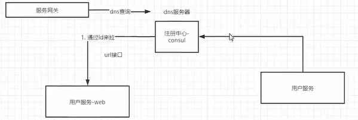

## 1 、什么是服务注册和发现以及技术选型

### 什么是服务注册和发现

假如这个产品已经在线上运行，有一天运营想搞一场促销活动，那么我们相对应的【用户服务】可能就要新开启三个微服务实例来支撑这场促销活动。而与此同时，作为苦逼程序员的你就只有手动去 API gateway 中添加新增的这三个微服务实例的 ip 与port ，一个真正在线的微服务系统可能有成百上千微服务，难道也要一个一个去手动添加吗？有没有让系统自动去实现这些操作的方法呢？答案当然是有的。

当我们新添加一个微服务实例的时候，微服务就会将自己的 ip 与 port 发送到注册中心，在注册中心里面记录起来。当 API gateway 需要访问某些微服务的时候，就会去注册中心取到相应的 ip 与 port。从而实现自动化操作。

### 技术选型

Consul 与其他常见服务发现框架对比，zookeeper采用java开发， consul 和 etcd 都是go开发，功能差不多，所以选用Go

| **名称**  | **优点**                                                     | **缺点**                                                     | **接口** | **一致性算法** |
| --------- | ------------------------------------------------------------ | ------------------------------------------------------------ | -------- | -------------- |
| zookeeper | 1.功能强大，不仅仅只是服务发现<br/> 2.提供 watcher 机制能实时获取服务提供者的状态 <br/>3.dubbo 等框架支持 | 1.没有健康检查<br/>2.需在服务中集成 sdk，复杂度高<br/>3.不支持多数据中心 | sdk      | Paxos          |
| consul    | 1.简单易用，不需要集成 sdk<br/>2.自带健康检查<br/>3.支持多数据中心<br/>4.提供 web 管理界面 | 1.不能实时获取服务信息的变化通知                             | http/dns | Raft           |
| etcd      | 1.简单易用，不需要集成 sdk<br/>2.可配置性强                  | 1.没有健康检查<br/>2.需配合第三方工具一起完成服务发现<br/>3.不支持多数据中心 | http     | Raft           |

## 2 、consul的安装和配置

### 安装

```shell
docker run -d -p 8500:8500 -p 8300:8300 -p 8301:8301 -p 8302:8302 -p 8600:8600/udp  consul consul agent -dev -client=0.0.0.0

docker container update --restart=always 容器id
```

### 访问

浏览器访问 http://192.168.0.251:8500

8600是dns的端口

### 访问dns

consul 提供dns的功能，可以让我们通过dig 命令行来测试，consul  dns 端口是 8600

```sh
dig @192.168.0.251 -p8600 consul.service.consul SRV
```

service.consul 是固定的，第一个是 consul 是自动注册的服务名，也可以是其他服务名。

dns 提供通过域名查询 ip、端口号 的功能。比如网关 gateway 可以通过服务 域名来查询 服务的ip 地址。





## 3、 服务注册和注销

1.  添加服务

    https://www.consul.io/api-docs/agent/service#register-service

   ```shell
   PUT http://192.168.0.251:8500/v1/agent/service/register  #注意有个版本号v1
   ```

2. 删除服务 https://www.consul.io/api-docs/agent/service#deregister-service

3. 设置健康检查  https://www.consul.io/api-docs/agent/check

   在添加服务的时候就可以设置健康检查参数

4. 同一个服务注册多个实例

5. 获取服务  https://www.consul.io/api-docs/agent/service#list-services

 

## 4、 go集成consul

```go
package main

import (
	"fmt"
	"github.com/hashicorp/consul/api"
)

func Register(address string, port int, name string, tags []string, id string) error {
	cfg := api.DefaultConfig()
	cfg.Address = "192.168.1.103:8500"

	client, err := api.NewClient(cfg)
	if err != nil {
		panic(err)
	}
	//生成对应的检查对象
	check := &api.AgentServiceCheck{
		HTTP:                           "http://192.168.1.102:8021/health",
		Timeout:                        "5s",
		Interval:                       "5s",
		DeregisterCriticalServiceAfter: "10s",
	}

	//生成注册对象
	registration := new(api.AgentServiceRegistration)
	registration.Name = name
	registration.ID = id
	registration.Port = port
	registration.Tags = tags
	registration.Address = address
	registration.Check = check

	err = client.Agent().ServiceRegister(registration)
	//client.Agent().ServiceDeregister()
	if err != nil {
		panic(err)
	}
	return nil
}

func AllServices() {
	cfg := api.DefaultConfig()
	cfg.Address = "192.168.1.103:8500"

	client, err := api.NewClient(cfg)
	if err != nil {
		panic(err)
	}

	data, err := client.Agent().Services()
	if err != nil {
		panic(err)
	}
	for key, _ := range data {
		fmt.Println(key)
	}
}
func FilterSerivice() {
	cfg := api.DefaultConfig()
	cfg.Address = "192.168.1.103:8500"

	client, err := api.NewClient(cfg)
	if err != nil {
		panic(err)
	}

	data, err := client.Agent().ServicesWithFilter(`Service == "user-web"`)
	if err != nil {
		panic(err)
	}
	for key, _ := range data {
		fmt.Println(key)
	}
}

func main() {
	//_ = Register("192.168.1.102", 8021, "user-web", []string{"mxshop", "bobby"}, "user-web")
	//AllServices()
	//FilterSerivice()
	fmt.Println(fmt.Sprintf(`Service == "%s"`, "user-srv"))
}
```

5、 为grpc服务添加viper和zap