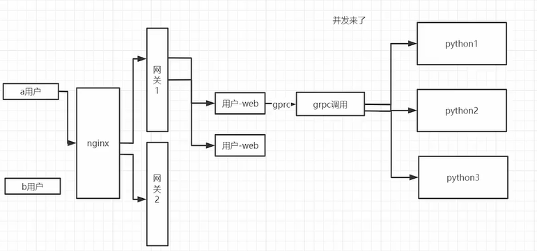

## 1、 动态获取可用端口

```go
func GetFreePort() (int, error) {
	addr, err := net.ResolveTCPAddr("tcp", "localhost:0")
	if err != nil {
		return 0, err
	}

	l, err := net.ListenTCP("tcp", addr)
	if err != nil {
		return 0, err
	}
	defer l.Close()
	return l.Addr().(*net.TCPAddr).Port, nil
}
```

对于grpc服务，会被注册到注册中心上，不管啥环境，都可以动态获取端口

```go
//使用consul后需要改成真实ip
IP := flag.String("ip", "192.168.0.105", "ip地址")
Port := flag.Int("port", 0, "端口号")

if *Port == 0 {
    *Port, _ = utils.GetFreePort()
}
```

对于web层的 gin 服务，需要判断是否开发环境来生成端口号

```go
viper.AutomaticEnv()
//如果是本地开发环境端口号固定，线上环境启动获取端口号
debug := viper.GetBool("MXSHOP_DEBUG")
if !debug {
    port, err := utils.GetFreePort()
    if err == nil {
        global.ServerConfig.Port = port
    }
}
```


## 2、 什么是负载均衡，负载均衡的策略有哪些？



负载均衡分为三类

1. 集中式 load balance
2. 进程内 load balance
3. 独立进程 load balance

一般我们选则第二种，第一种流量过于集中，第三种需要多维护一个独立的 进程。


## 3、 常用负载均衡算法

## 4 、grpc从consul中同步服务信息并进行负载均衡

grpc 官方文档： https://github.com/grpc/grpc/blob/master/doc/load-balancing.md

grpc-consul-resolver：开源项目，专门用于从consul拉取服务信息。

Service Config 配置官方文档：https://github.com/grpc/grpc/blob/master/doc/service_config.md

```go
package main

import (
	"OldPackageTest/grpclb_test/proto"
	"context"
	"fmt"
	"log"

	_ "github.com/mbobakov/grpc-consul-resolver" // It's important,会自动执行 init()函数

	"google.golang.org/grpc"
)

func main() {
	conn, err := grpc.Dial(
		"consul://127.0.0.1:8500/user-srv?wait=14s&tag=srv",  //注意不是下划线 user_src,之前写错过
		grpc.WithInsecure(),
		grpc.WithDefaultServiceConfig(`{"loadBalancingPolicy": "round_robin"}`),
	)
	if err != nil {
		log.Fatal(err)
	}
	defer conn.Close()

	for i := 0; i < 10; i++ {
		userSrvClient := proto.NewUserClient(conn)
		rsp, err := userSrvClient.GetUserList(context.Background(), &proto.PageInfo{
			Pn:    1,
			PSize: 2,
		})
		if err != nil {
			panic(err)
		}
		for index, data := range rsp.Data {
			fmt.Println(index, data)
		}
	}

}
```

## 5、 grpc从consul中同步服务信息并进行负载均衡

user_srv /main.go

```go
//生成注册对象
registration := new(api.AgentServiceRegistration)
registration.Name = global.ServerConfig.Name
//ID相同会导致服务注册信息覆盖，所以一个服务启动多个实例需要ID不同。
serviceID := fmt.Sprintf("%s", uuid.NewV4()) 
registration.ID = serviceID
registration.Port = *Port
registration.Tags = []string{"imooc", "bobby", "user", "srv"}
registration.Address = "192.168.0.105"
registration.Check = check
//1. 如何启动两个服务
//2. 即使我能够通过终端启动两个服务，但是注册到consul中的时候也会被覆盖,需要使用uuid生成不同ID
err = client.Agent().ServiceRegister(registration)
```

优雅退出，接收到退出信号号 进行服务注销

```go
//异步化，不然会阻塞，无法执行下面的方法。
go func() {
		err = server.Serve(lis)
		if err != nil {
			panic("failed to start grpc:" + err.Error())
		}
	}()


//接收终止信号
quit := make(chan os.Signal)
signal.Notify(quit, syscall.SIGINT, syscall.SIGTERM)
<-quit
if err = client.Agent().ServiceDeregister(serviceID); err != nil {
    zap.S().Info("注销失败")
}
zap.S().Info("注销成功")
```

## 6、 gin集成grpc的负载均衡

```go
import (
	"fmt"
	"github.com/hashicorp/consul/api"
	_ "github.com/mbobakov/grpc-consul-resolver" // It's important,会自动执行 init()函数
	"go.uber.org/zap"
	"google.golang.org/grpc"
	"mxshop-api/user-web/global"
	"mxshop-api/user-web/proto"
)

func InitSrvConn() {
	consulInfo := global.ServerConfig.ConsulInfo
	userConn, err := grpc.Dial(
		fmt.Sprintf("consul://%s:%d/%s?wait=14s", consulInfo.Host, consulInfo.Port, global.ServerConfig.UserSrvInfo.Name),
		grpc.WithInsecure(),
		grpc.WithDefaultServiceConfig(`{"loadBalancingPolicy": "round_robin"}`),
	)
	if err != nil {
		zap.S().Fatal("[InitSrvConn] 连接 【用户服务失败】")
	}

	userSrvClient := proto.NewUserClient(userConn)
	global.UserSrvClient = userSrvClient
}
```

