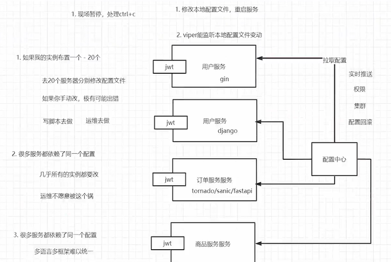
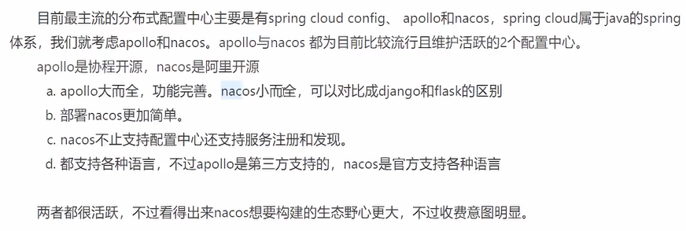
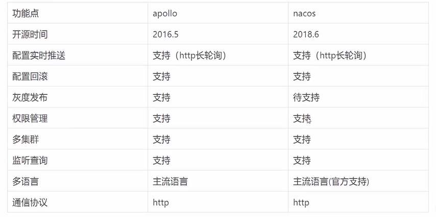
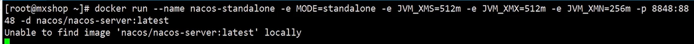

## 1、 为什么需要配置中心

1、配置有变动，如果实例很多，需要修改的地方很多，工作量太大。

2、很多服务依赖了同一个配置，比如 secret，没有配置中心的话，需要每个服务都配置，没法复用。

3、多语言、多框架难以统一。




## 2、 配置中心选型-apollo vs nacos!



## 3、 nacos的安装

## 

访问： http://localhost:8848/nacos/index.html

用户名密码： nacos  / nacos


## 4、 nacos的组、配置集、命名空间

Data ID: 配置集，类似于配置的文件名，或者某一模块的配置，一个配置集存放的是一类集合。

命名空间: 配置集隔离，一般用来区分 微服务。

组：用来区分 开发、测试 、生产环境


## 5、 通过api获取nacos的配置以及nacos的配置更新

```go
package main

import (
	"OldPackageTest/nacos_test/config"
	"encoding/json"
	"fmt"
	"github.com/nacos-group/nacos-sdk-go/clients"
	"github.com/nacos-group/nacos-sdk-go/common/constant"
	"github.com/nacos-group/nacos-sdk-go/vo"
)

func main() {
	sc := []constant.ServerConfig{
		{
			IpAddr: "127.0.0.1",  //服务地址错误，重启后仍然可以从缓存中读取配置
			Port:   8848,
		},
	}

	cc := constant.ClientConfig{
		NamespaceId:         "fbdb7768-0396-4a52-8e3f-f2230a7729a4", // 如果需要支持多namespace，我们可以场景多个client,它们有不同的NamespaceId
		TimeoutMs:           5000,
		NotLoadCacheAtStart: true,
		LogDir:              "tmp/nacos/log",
		CacheDir:            "tmp/nacos/cache",
		LogLevel:            "debug",
	}

	configClient, err := clients.CreateConfigClient(map[string]interface{}{
		"serverConfigs": sc,
		"clientConfig":  cc,
	})
	if err != nil {
		panic(err)
	}

	content, err := configClient.GetConfig(vo.ConfigParam{
		DataId: "user-web.yaml",
		Group:  "dev"})

	if err != nil {
		panic(err)
	}
	fmt.Println(content) //字符串 - yaml
	err = configClient.ListenConfig(vo.ConfigParam{
		DataId: "user-web.yaml",
		Group:  "dev",
		OnChange: func(namespace, group, dataId, data string) {
			fmt.Println("配置文件变化")
			fmt.Println("group:" + group + ", dataId:" + dataId + ", data:" + data)
		},
	})
	time.Sleep(3000 * time.Second)
}
```

## 6、 gin集成nacos

go语言本身支持将 json 转换成 struct,为了减少第三方库，配置格式使用json

yaml 在线转 json : https://www.bejson.com/validators/yaml_editor/


## 7、  service集成nacos