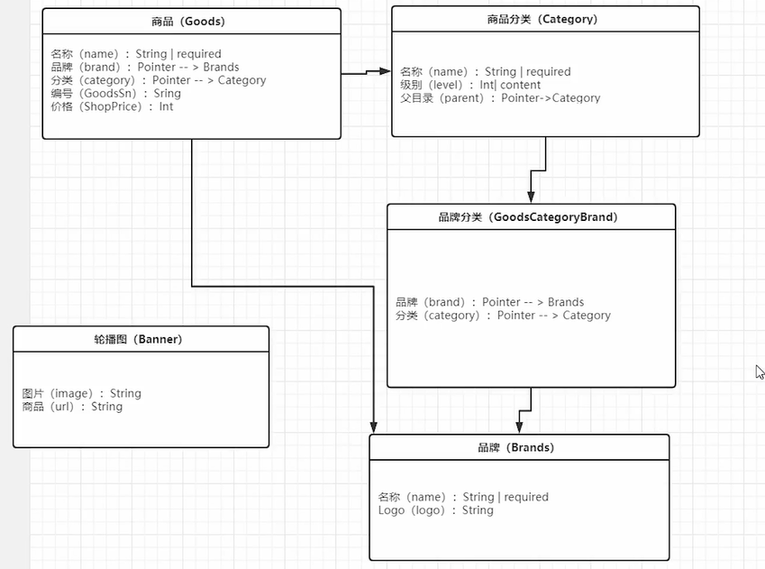

## 1、 需求分析-数据库实体分析


## 


## 2、 需求分析-商品微服务接口分析


## 3、 商品分类表结构设计应该注意什么？

```
类型， 这个字段是否能为null， 这个字段应该设置为可以为null还是设置为空， 0
实际开发过程中 尽量设置为不为null，而是设置默认值
https://zhuanlan.zhihu.com/p/73997266
这些类型我们使用int32还是int，proto中没有int类型，为了减少类型转换，使用int32
```

## 4、 品牌、轮播图表结构设计

**CategoryID 和 BrandsID构成 唯一联合索引，防止插入重复数据。**

```go
type GoodsCategoryBrand struct {
	BaseModel
	CategoryID int32 `gorm:"type:int;index:idx_category_brand,unique"`
	Category   Category

	BrandsID int32 `gorm:"type:int;index:idx_category_brand,unique"`
	Brands   Brands
}

func (GoodsCategoryBrand) TableName() string {	//自定义表名
	return "goodscategorybrand"
}
```

